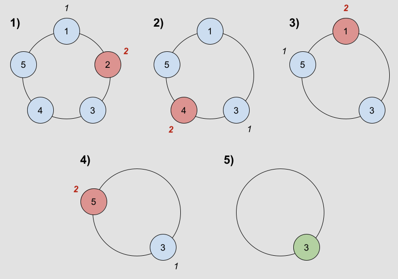

# 1823. Find the Winner of the Circular Game

> [LeetCode](https://leetcode.com/problems/find-the-winner-of-the-circular-game/description/)

문제해결 수업 Weekly problem 중 하나였다.

## 문제 설명

해당 문제는 n 명의 사람이 원형으로 앉아있고 k 번째 사람을 제거하는 과정을 반복하다가 마지막 한 명이 남을 때 그 사람의 번호를 출력하는 문제이다.

## 해결 과정

일단 이 문제가 나온 주차의 수업 내용이 recursion이기 때문에 처음에는 recursion으로 풀려고 했으나 도저히 생각이 나지 않아서 다른 방법을 생각해보았다.



문제에 있는 사진을 보면 서로 연결되어 있는 노드처럼 보여가지고 링크드 리스트를 이용하면 될 것 같다고 생각했다. 그런데 그냥 linked list로 구현을 하면 삭제하고 나서 다음 노드를 찾아가는 과정이 복잡해졌다. 그래서 알아본 결과 다들 queue를 사용해서 dequeue와 enqueue를 반복하는 방법으로 구현을 한다는 것을 알고 이 방법을 사용했다.

### Queue를 사용한 방법

```c
typedef struct node {
    int value;
    struct node *next;
} node;

int findTheWinner(int n, int k) {
    int count = 0;
    node *head = (node *) malloc(sizeof(node));
    node *tail = head;
    head->value = 1;
    head->next = NULL;
    for (int i = 2; i <= n; i++) {
        tail->next = (node *) malloc(sizeof(node));
        tail = tail->next;
        tail->value = i;
        tail->next = NULL;
    }
    while (head->next != NULL) {
        for (int i = 0; i < k; i++) {
            tail->next = head;
            head = head->next;
            if (i == k - 1) {
                count++;
                tail->next = NULL;
                break;
            }
            tail = tail->next;
        }
    }
    return head->value;
}
```

위와 같이 매번 dequeue한 후에 다시 enqueue를 하다가 삭제할 부분이 오면 enequeue를 하지 않고 그냥 끊어버리는 방식으로 구현을 했다. 다만 이럴 경우 시간 복잡도가 일단 O(nk)가 되고 공간 복잡도도 O(n)이 되기 때문에 좋은 방법은 아닌 것 같다.

### Recursion을 사용한 방법

그래서 Recursion을 사용한 방법으로 코드를 바꾸고 싶은데 아직 recursion으로 구현하는 것은 base point와 P(n)을 P(n-1) 꼴로 나타내는 것이 중요하다는 것만 알지 이를 구하는 방법을 잘 모르겠어서 유튜브를 뒤져봤다.

> [해당 문제 유튜브 강의](https://www.youtube.com/watch?v=XG6txfMFBVk&ab_channel=DominikIlja)

해당 강의를 통해 P(1,2) ~ P(5,2)일 때의 winner를 찾아보니 규칙이 있었다.

P(1,2)은 1, P(2,2)는 1, P(3,2)는 3, P(4,2)는 1, P(5,2)는 3이었다. 이를 식으로 나타내면 P(n,k) = (P(n-1,k) + k) % n 이라는 식이 나온다.

이렇게 P(n,k) 식을 구했으니 코드로 구현을 하면 아래와 같다.

> 다만 이는 zero-based index이기 때문에 1을 더해주어야 한다.

```c
int helper(int n, int k) {
    if (n == 1) return 0;
    return (k + helper(n - 1, k)) % n;
}

int findTheWinner(int n, int k) {
    return helper(n, k) + 1;
}
```

덕분에 시간 복잡도는 O(n)이 되었고 공간 복잡도는 O(1)이 되었다.
