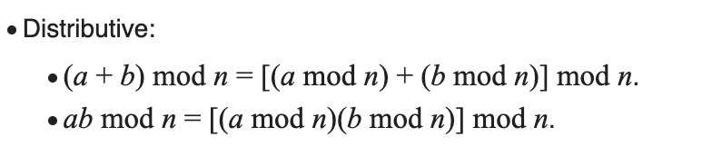

# 나머지 연산 분배법칙

> ref. [백준 문제 예제](https://www.acmicpc.net/problem/1904)

위와 같이 PS 문제를 풀다보면 값이 너무 커져 overflow가 발생하는 것을 막기 위해 나머지를 출력하게 한다.

따라서 숫자가 커지지 않게 연산 중간에 나머지 연산을 해주어야 한다. 하지만 단순히 중간에만 나머지 연산을 해주면 원하는 결과가 나오지 않는다.

이때 사용하는 것이 나머지 연산 분배법칙이다. 나머지 연산 분배법칙은 다음과 같다.

> ref. [Modulo - Wikipedia](https://en.wikipedia.org/wiki/Modulo#:~:text=%3D%201.-,Distributive,-%3A)

위와 같이 계산 중간에 나머지 연산을 하고 나중에 한 번 더 나머지 연산을 한 값은 마지막에만 나머지 연산을 한 값과 같다.

단 뺄셈 같은 경우에는 음수가 나올 수 있으므로 음수가 나올 수 있는 경우에는 `+ m`을 해주어야 한다. 이 떄 m은 나머지 연산을 할 수이다.

> (a - b) mod m = (a mod m - b mod m + m) mod m
