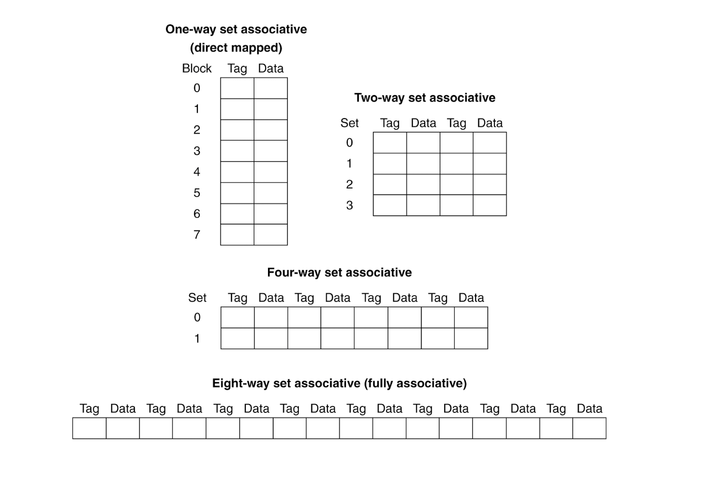
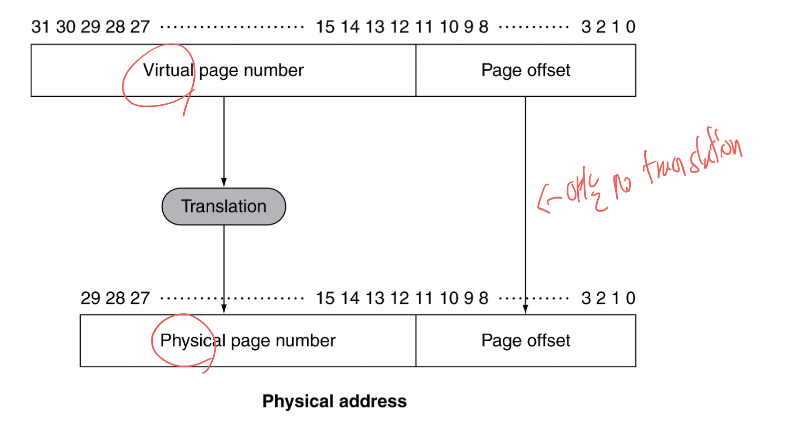

# 컴퓨터구조개론 13주 차

## Measuring Cache Performance

CPU time은 프로그램이 실행되는 cycles와 memory stall cycles로 구성된다. memory stall cycles는 memory access \* miss rate \* miss penalty로 볼 수 있다.

### Cache Performance Example

- I-cache miss rate: 2%
- D-cache miss rate: 4%
- Miss penalty: 100 cycles
- Base CPI(모두 hit일 때): 2
- load & stores : 36%

위와 같이 조건이 주워지면

- Miss cycles per instructions
  - I-cache: 2% \* 100 = 2 cycles
  - D-cache: 0.36 \* 4% \* 100 = 1.44 cycles

따라서 Acutual CPI는 2 + 2 + 1.44 = 5.44 cycles이다.

### Average Memory Access Time

줄여서 AMAT은 Hit time + Miss rate \* Miss penalty로 구할 수 있다. 예를들어서 2ns clock, hit time = 1cycle, miss penalty = 20 cycles, I-cache miss rate = 6%이면 AMAT = 2ns \* 100% + 40ns \*6% = 4.4ns이다.

## Improving cache performance

이전에는 slot이 하나만 있는 direct-map을 봤는데 이제는 slot이 여러개인 cache를 배운다.

### Associative cache

> ref. 컴퓨터구조개론 조형민 교수님 강의자료

- Set associative cache
  - e.g. 2-way set associative cache
  - 2-way set associative cache는 2개의 slot이 있고 각 slot은 2개의 block을 가진다.
  - set마다 comparator가 있어야 한다.
  - 반드시 power-of-2가 아니여도 된다.
  - block number는 set index에 의해 결정된다.
    - block number % set number
- Fully associative cache
  - 어디든 들어갈 수 있다.
  - 동시에 모든 장소를 검색하기 위해 개체마다 comparator가 있어야 한다.
  - cache index가 필요 없다.

### Replacement policy for set associative cache

여기서도 LRU replacement policy가 나왔지만 set의 수가 많아지면 LRU를 구현하기 어렵다. 따라서 Pseudo-LRU를 사용한다.

Pseudo-LRU는 2개의 개체마다 1개의 LRU bit가 존재하는데 이때 개체는 block이 될 수 있고 lru bit일 수 있다. 이는 tree-like structure이다.

lru bit은 replace 할 buffer를 가르키는데 가지고 있는 개체들 중 접근이 가장 오래된 개체를 가르킨다.

### Multi-level cache

Primary cache 즉 L1 cache는 작기 때문에 miss rate가 높다. 따라서 L2 cache를 둬서 miss rate를 줄인다. 요즘에는 추가로 L3 cache를 둔다.

#### Multi-level cache Example

- CPU base CPI: 1.0
- clock rate = 4GHz
- Miss rate / instruction = 2%
- Main memory access time = 100ns

오직 L1 cache만 있을 때에는 Miss penalty = 100ns/0.25ns = 400 cycles이다. 따라서 AMAT = 1 + 2% \* 400 = 9 cycles이다.

> 4GHz = 1 clock당 0.25ns

여기에 Access time이 5ns인 L2 cache를 추가한다면 Miss penalty = 5ns/0.25ns = 20 cycles이다. 또한 전체 중에 main memory로 빠지는 경우가 0.5%이면 AMAT = 1 + 2% \* 20 + 0.5% \* 400 = 3.4이다.

L1 cache는 사이즈가 작은 대신 빠르기 때문에 hit time에 중점이 되어 있고 L2 cache는 사이즈가 큰 대신 느리기 때문에 miss rate을 피하는데 중점이 되어 있다.

#### Sources of Misses

- Compulsory misses
  - 처음에는 어쩔 수 없이 발생하는 misses
  - prefetching을 통해 줄일 수 있다.
- Capacity misses
  - cache가 너무 작아서 발생하는 misses
  - cache size를 늘려서 줄일 수 있다.
- Conflict misses
  - non-fully associative cache에서 발생하는 misses
  - set의 수를 늘려서 줄일 수 있다.

## Virtual Memory

각 프로그램마다 Virtual Memory를 가지고 있다. 물론 실제로는 Physical Memory를 가지고 있다. 이때 mem이 부족해지면 Disk access를 하는데 이를 swap이라고 한다.

어쨋든 Virtual address를 physical address로 바꾸는 것을 translation이라고 한다.

### Address Translation

위와 같이 lower order 12 bits는 page offset으로 그대로 사용하고 나머지 virtual page number를 사용해서 translation을 한다. 이떄 등장하는 것이 page table이다.

#### Page Table & PTE

page table는 virtual page number을 인덱스로 하는 배열의 형태로 되어 있다. 이때 Page Table Entry(PTE)는 valid bit, dirty bit, reference bit, physical page number로 구성되어 있다. 예를 들어 0x1000가 virtual address이면 virtual number인 1을 인덱스로 하여 page table entry를 찾고 만약에 거기에 physical page number가 3이면 physical address는 0x3000이 된다.

어쨋든 PTE는 virtual page number bit 수가 20이라면 2^20개가 필요하기 때문에 이는 main memory에 저장되고 이는 각 프로세스마다 존재한다. 그리고 CPU에는 따로 이러한 table의 위치를 알려주는 register가 있다.

#### Page Fault

Page fault는 virtual page가 physical page에 없을 때 발생한다. 이때 page fault handler가 page를 가져와서 physical page에 저장한다. 이때 page fault handler는 disk access를 하기 때문에 매우 느리다.
