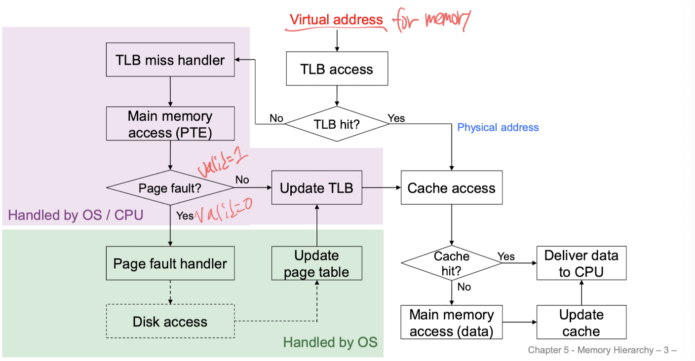

# 컴퓨터구조개론 14주 차

## TLB

PTE는 메모리에 저장되어 있다보니 접근하는데 시간이 오래걸린다. 그래서 TLB라는 것을 사용한다. TLB는 Translation Look-aside Buffer로 PTE의 cache인 것이다. TLB는 보통 associative memory로 구현된다. TLB는 PTE의 cache이기 때문에 TLB miss가 발생하면 PTE를 찾아서 TLB에 저장한다. 근데 만약에 PTE에도 없다면 page fault가 발생한다. 이땐 page fault handler가 PTE를 메모리에 올리고 TLB에 저장한다.

## Floating Point

소수를 binary를 표현하는 방법에 대해서 배웠는데 초반에는 Binary로 단순히 정수부분 fraction 부분을 나눠서 표현하는 fixed-point format를 설명하셨는데 이는 범위의 제한되어서 좋지 않은 방법이였다. 그래서 표준화된 IEEE 754에 대해서 설명하셨다.

### IEEE 754 Floating Point Format

Single precision은 32bit, Double precision은 64bit이다. Single precision은 1bit sign, 8bit exponent, 23bit fraction으로 구성되어있고 Double precision은 1bit sign, 11bit exponent, 52bit fraction으로 구성되어있다.

#### Single Precision Example

만약에 -0.75를 표현한다면 다음과 같이 표현할 수 있다.

- -0.75 = -(3/4) = -(3 \* 2^-2) = -1.1 \* 2 ^ -1
- sign: 1
- exponent: -1 + 127 =-1 + Bias = 126 = 01111110
- fraction: 100000000000...0
