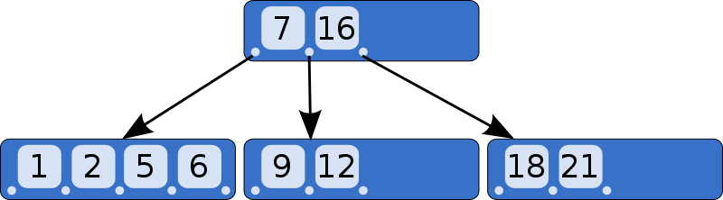

# B-tree와 B+tree

B 트리는 이진 트리의 Unbalanced 문제를 해결하기 위해 고안된 자료구조이다. 이는 많은 곳에서 사용되는 자료구조인데 DB 인덱싱에서도 여기서 더 발전한 B+tree를 사용한다. 현재 데이터베이스개론 수업을 듣고 있기 때문에 B-tree들에 대해서 공부하려고 한다.

> ref. [그림으로 알아보는 B-Tree](https://velog.io/@emplam27/%EC%9E%90%EB%A3%8C%EA%B5%AC%EC%A1%B0-%EA%B7%B8%EB%A6%BC%EC%9C%BC%EB%A1%9C-%EC%95%8C%EC%95%84%EB%B3%B4%EB%8A%94-B-Tree), [Wikipedia](https://en.wikipedia.org/wiki/B-tree)

## B-tree

B+tree는 B-tree에서 발전한 형태이기 때문에 B-tree에 대한 이해가 먼저라고 생각해서 이부터 정리하려고 한다.

B-tree이 만족해야 하는 특징으로는 아래와 같다.

- 모든 노드는 최대 m개의 자식을 가질 수 있다.
- 모든 interal node(leaf node가 아닌 노드)는 최소 m/2 개의 자식을 가진다.
- 모든 non-leaf node는 최소 2개의 자식을 가진다.
- 모든 leaf node는 같은 레벨에 존재한다.
- k개의 자식을 가진 internal node는 k-1개의 key를 가진다.

> ref. [Wikipedia](https://en.wikipedia.org/wiki/B-tree)

B-tree는 위와 같은 형태를 가진다. 밝은 파란색은 key 값이고 왼쪽엔 key 값보다 작은 노드의 pointer가 오른쪽엔 key 값보다 큰 노드의 pointer가 존재한다. 또한 각 key들은 sorting 되어 있다.

### 검색과정

root node에서 시작하여 key들과 대소관계를 통해 검색을 하는데 이를 leaf node에 도달하거나 찾을 때 까지 반복하는데 leaf node에 도달해서도 없으면 없는 것으로 판단한다.

### 삽입과정

검색 과정은 tree의 형태를 바꾸는 것이 없기 때문에 b-tree의 만족 조건을 지킬 필요가 없어서 매우 간단하지만 삽입하거나 삭제하는 과정에서는 필요한 과정들이 있어 복잡하다.

일단 큰 틀은 삽입할 leaf node를 탐색하고 삽입할 leaf node가 없으면 기존 node를 분할해서 삽입하는 방식이다. 삽입을 위한 검색은 위에서 아래로 내려오지만 분할은 아래에서 다시 위로 올라가는 식으로 진행된다.

leaf node까지의 탐색은 검색과정과 유사하게 진행된다. 이때 삽입을 위한 leaf node에 도달하고 해당 node가 가득차지 않았으면 오름차순으로 그냥 key를 삽입하면 되지만 해당 노드가 가득차면 분할을 해야한다.

분할은 key를 삽입한 뒤 중간값으로 분할을 하고 중간값은 부모노드에 오름차순으로 삽입을 한다. 이때 부모노드가 가득차면 다시 분할을 해야하는데 이 과정을 반복하면서 root node까지 올라가면 된다.

### 삭제과정

삭제는 좀 더 복잡하다. 하지만 과정은 유사한데 삭제할 키가 있는 node를 검색하고 삭제하는데 삭제 과정에서 만족 조건을 위배하면 이를 다시 만족시키기 위해서 균형을 재조정해야 한다.

#### Case 1. 삭제할 key가 leaf node에 있을 경우

삭제 후 node의 key 개수가 최소 key 개수보다 크면 재조정은 안한다. 하지만 최소 key 개수보다 작아지면 균형을 재조정해야 한다.

왼쪽 또는 오른쪽 sibling node의 key가 최소 key 개수를 초과하면 삭제할 key를 부모 key로 대체하고 초과한 node가 왼쪽 sibling node이면 가장 큰값을 오른쪽이라면 가장 작은 값을 부모 key와 대체한다.

하지만 sibling 둘다 최소 key이고 parent node의 key가 최소개수를 초과하면 부모 노드의 key 중 하나를 sibling node로 내려준다.

하지만 모두 최소 key라면 재구조화가 일어나는데 이는 Case 3에서 설명한다.

#### Case 2. 삭제할 key가 internal node에 있고 노드나 자식의 키가 최소 개수보다 많을 경우

현재 노드의 inorder predecessor 또는 inorder successor와 k의 자리를 바꾼다. 이후에는 Case 1에서 설명한 방법으로 진행한다.

> inorder predecessor: k의 왼쪽 서브트리에서 가장 큰 key, inorder successor: k의 오른쪽 서브트리에서 가장 작은 key

#### Case 3. 삭제할 key가 internal node에 있고 노드나 자식의 키가 모두 최소 개수일 경우

이는 재구조화가 일어나야 한다. 재구조화는 아래와 같은 과정을 거친다.

1. k를 삭제하고, k의 양쪽 자식을 병합한다.
2. k의 parent node를 인접한 sibling node에 붙이고 이전에 병합했던 node를 child node로 붙인다.
3. 만일 이 과정에서 sibling node가 최대 key를 넘긴다면 분할 과정을 수행한다.
4. 이렇게 sibling node에 붙이더라도 최소 key 개수보다 작다면 2번 과정부터 다시 수행한다.

위 예시들은 모두 그림을 보고 이해하는 것이 빠르기 때문에 참조한 글을 보고 이해하면 좋다.

## B+tree

DB의 인덱싱에서 사용되는 자료구조로 B-tree의 변형이다. B-tree와의 차이점은 아래와 같다.

- leaf node에 key와 data가 모두 저장된다.
- leaf node는 linked list로 연결되어 있다.
- leaf node의 parent key는 leaf node의 가장 왼쪽 key 보다 작거나 같다.

검색과정은 B-tree와 동일하다.

### B+tree 삽입과정

#### Case 1. 분할이 일어나지 않고, 삽입 위치가 leaf node의 가장 앞 key일 경우

가장 앞인 경우는 parent key보다 작은 경우이기 때문에 parent key를 삽입된 key로 대체하고 삽입된 key를 leaf node의 가장 앞에 삽입한다.

#### Case 2. 분할이 일어나는 삽입과정

leaf node에서 분할이 일어날 때에만 B-tree와 다른 수행과정이 필요하다.

중간 key를 부모 key로 올리는 것은 같지만 분할 할 때 오른쪽 node에 중간 key를 포함하여 분할해야 한다. 또한 leaf node는 linked list이기 때문에 분할된 left sibling node와 right sibling node를 연결해줘야 한다.

### B+tree 삭제과정

삭제할 key가 leaf node의 가장 처음 key인 경우 key가 항상 index 내에 존재하기 때문에 삭제 후에도 index 내에 존재한다. 따라서 이를 삭제하는 과정이 필요하게 되다.

먼저 key를 삭제하는 과정을 수행하는데 이는 B-tree와 유사하다. key의 개수가 최소 key의 개수이라면 sibling node의 key를 빌려오거나 parent key와 병합하는 등의 과정은 동일하게 수행하지만 오른쪽 자식의 처음 key와 parent key는 서로 동일하기 때문에 parent key를 가져오는 과정은 생략한다.

이후 index 내의 key를 inorder successor로 변경한다.

> 추후에 데이터베이스 과제를 통한 B+tree 구현을 하면서 더 내용을 가꿀 예정이다.
