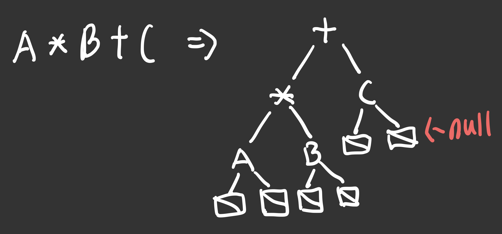
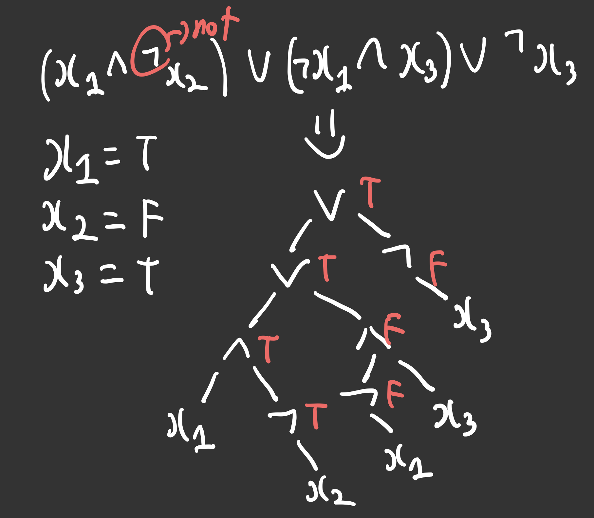

# 자료구조개론 10주 차

## Binary Tree

저번 주차에는 Tree의 개념과 Tree의 종류에 대해서 알아보았다. 이번 주차에는 이어서 binary tree에 대해 더 알아본다.

### Binary Tree Traversal

Binary Tree의 순회 방법에는 3가지가 있다.

- Inorder aka depth-first traversal
  - LVR (Left-Visit-Right)
- Preorder
  - VLR (Visit-Left-Right)
- Postorder
  - LRV (Left-Right-Visit)

이를 사용해서 저번에 배운 Arithmetic Expression을 postfix, infix로 표현할 수 있는데 먼저 Arithmetic Expression을 binary tree로 표현하고

이를 postorder로 순회하면 postfix로, inorder로 순회하면 infix로 표현할 수 있다. 참고로 leaf node에는 null pointer이 연결되어 있는데 이는 구현으로서의 편의를 위한 것이다.

#### Inorder Traversal

Inorder Traversal를 구현하기 위해서는 recursive하게 구현하거나 iterative하게 구현할 수 있다.

recursion은 pointer가 null일 때까지 먼저 left subtree를 순회하고 그 다음에 node의 data를 visit 하고 그 다음에 right subtree를 순회한다.

iterative하게 구현할 때는 stack을 사용해서 구현할 수 있다. 먼저 root node를 stack에 push하고 left subtree를 순회하면서 stack에 push한다. 그 다음에 stack에서 pop하면서 node의 data를 visit하고 right subtree를 순회하면서 stack에 push한다. 이를 stack이 empty일 때까지 반복한다.

> preorder, postorder traversal도 여기서 순서를 바꾸면 구현이 가능하다.

#### Level-order Traversal

Breath-first traversal이라고도 불리는 이 순회 방법은 queue를 사용해서 구현할 수 있다. 먼저 root node를 queue에 enqueue하고 queue가 empty일 때까지 dequeue하면서 node의 data를 visit하고 left subtree, right subtree를 순회하면서 queue에 enqueue한다.

### Copying and Testing for Equality

- Copying
  - recursion을 사용해서 구현할 수 있다.
  - 임시 pointer에 새로운 node를 만들고 해당 노드의 left child, right child에 대해서 재귀적으로 copy를 수행한다.
- Testing for Equality
  - recursion을 사용해서 구현할 수 있다.
  - first와 second가 모두 null이면 true를 return한다.
  - first와 second가 모두 null이 아니면서 data가 같으면서 left subtree와 right subtree가 모두 같으면 true를 return한다.
  - 이때 left subtree와 right subtree가 모두 같은지 확인하기 위해서 재귀적으로 구현한다.

### Satisfiability Problem

변수들과 operators(and, or, not)으로 구성된 공식의 결과가 true가 될 수 있는 조합을 찾는 문제를 satisfiability problem이라고 한다. 변수들은 true 또는 false가 될 수 있다.

이를 binary tree로 표현을 하고 inorder traversal을 하면서 변수들을 true 또는 false로 바꿔가면서 결과가 true가 되는 조합을 찾을 수 있다.

각 node는 operator 또는 값이 data와 값이 들어 있는 value와 left child, right child를 가르키는 pointer로 구성되어 있다.

값을 구하기 위해 순회를 할 때 post-order을 해야지 변수에서 먼저 값을 가져오고 연산자를 적용할 수 있다.

### Threaded Binary Tree

Threaded binary tree는 binary tree의 모든 leaf node에 null pointer가 아닌 다른 node를 가르키도록 하는 것이다. 이때 left child가 null이면 left child가 inorder predecessor를 가르키고 right child가 null이면 right child가 inorder successor를 가르킨다.

구현의 편의를 위해 head node를 추가해서 구현한다. 따라서 left last node는 head node를 가르키고 right last node도 head node를 가르킴으로써 모든 leaf node가 null pointer가 아닌 다른 node를 가르키도록 한다. 또한 head node의 right child는 자기 자신을 가르키도록 해서 구현의 편의를 높인다.

해당 tree의 노드는 leftChild와 rightChild가 thread 인지 나타내는 변수를 각각 가지고 있고 나머지는 동일하다.

이렇게 구현을 하면 제일 먼저 left last node를 방문하면 right child pointer을 통해 tree traversal이 가능해진다.

### How to rebuild a tree from traversal result

먼저 post order traversal를 통해 root node를 찾고 inorder traversal을 통해 left subtree와 right subtree를 찾는다. 나머지 subtree들 또한 recursive하게 찾을 수 있다.
