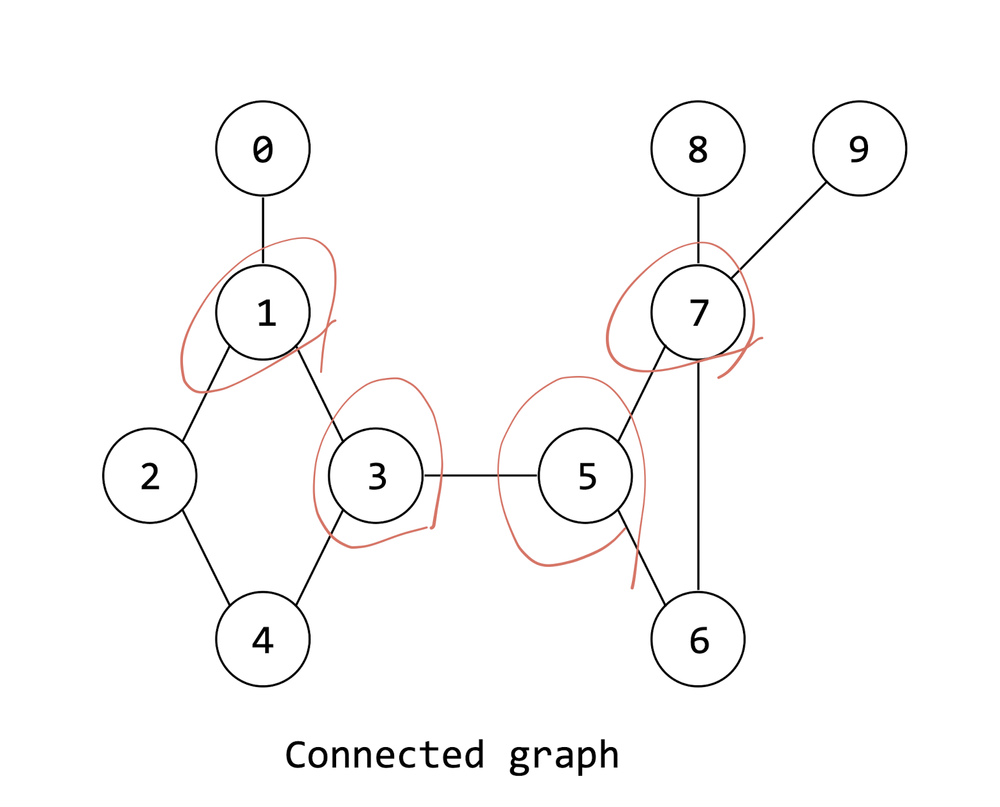
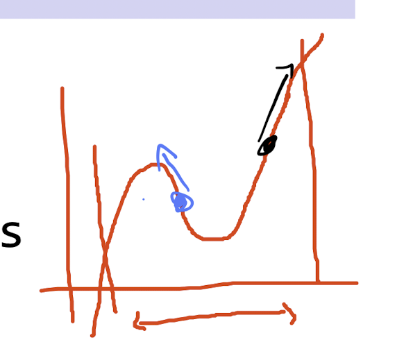
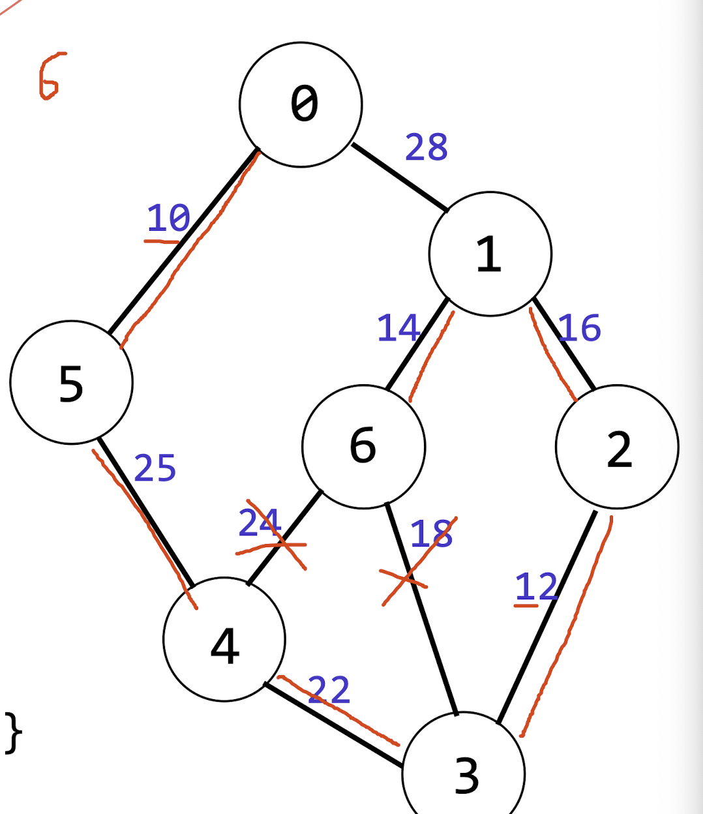
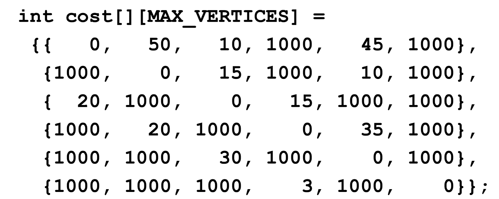

# 자료구조론 13주 차

## Graph Tarversal

모든 정점을 방문하는 방법은 DFS와 BFS가 있는데 DFS는 방문을 확인하는 배열을 사용하여 방문하지 않은 정점으로 재귀호출을 하고, BFS는 큐를 사용하여 방문하지 않은 정점을 큐에 넣고 반복문을 통해 방문한다.

DFS와 BFS를 사용하여 모든 정점을 방문했으면 이를 complete graph라고 한다. 또한 graph 일부 중 모든 정점이 방문 가능하면 complete component라고 한다.

complete components는 방문하지 않은 정점들로 DFS 또는 BFS를 여러번 사용하여 찾을 수 있다.

### Spanning Tree

Spanning Tree는 순회하도록 하는 간선이 없는 그래프이다. Spanning Tree는 complete graph의 경우 정점의 개수 - 1개의 간선을 가진다.

이는 DFS 또는 BFS를 통해 찾을 수 있는데 이들이 수행하면서 사용한 간선을 모으면 된다.

### Finding Articulation Points

Articulation Point는 그래프에서 정점을 제거했을 때 그래프가 두 개 이상의 complete component로 나누어지는 정점이다. 이와 달리 bi-connected graph는 이러한 aritculation point가 없는 그래프이다. bi-connected component 또한 존재한다.

이를 찾으려면 depth first number(DFN)와 backedge를 사용하여 찾을 수 있는데 먼저 DFN은 dfs를 수행하면서 정점에 번호를 매기는 것이다. back edge는 graph에서 자신의 조상과 연결된 간선이다.

또한 low number은 자신의 dfn, 자식의 dfn, back edge의 dfn 중 가장 작은 값이다. 여기서 자식은 dfs 수행한 정점에서 자신과 연결된 정점 중 dfn이 작은 정점들이다. 참고로 이 low number은 자식에 의해 정해지므로 leaf node부터 계산해야 한다.

이를 통해 articulation point를 찾을 수 있는데 root 노드일 경우 자식이 2개 이상이면 articulation point이다. root 노드가 아닐 경우 자신의 자식들 중 low number가 자신의 dfn보다 크거나 같으면 articulation point이다.

### Minimum Spanning Tree

앞서 설명한 Spanning Tree 중 간선의 가중치의 합이 최소인 것을 Minimum Spanning Tree라고 한다. 이는 Kruskal's Algorithm과 Prim's Algorithm을 통해 찾을 수 있다.

어쨋든 이들은 Greedy method를 사용하는데 이는 현재 상황에서 최선의 선택을 하는 것이다. 떄문에 어떠한 문제에서는 최적해를 찾을 수 없다. 사진에서 보다시피 파란색에서 시작하면 최적해를 찾을 수 없다. 하지만 이번 Minimum Spanning Tree 문제에서는 최적해를 찾을 수 있어서 이를 사용한다.

#### Kruskal's Algorithm

Kruskal's Algorithm은 간선을 가중치의 오름차순으로 정렬한 뒤 가중치가 작은 간선부터 선택하면서 cycle이 생기지 않도록 하는 것이다. 만약에 cycle이 생기면 그 간선은 버리고 다음 간선을 선택한다.

이렇게 n-1개의 간선을 선택하면 Minimum Spanning Tree가 완성된다.

위 그래프는 0 -> 5 -> 4 -> 3 -> 2 -> 1 -> 6 순서대로 간선을 선택하게 된다.

#### Prim's Algorithm

이는 먼저 한 정점을 선택한 뒤 그 정점과 연결된 간선 중 가중치가 가장 작은 간선을 선택한다. 단 새로운 배열을 하나 만들어서 이미 선택한 정점을 저장하기 때문에 이를 통해서 더 쉽게 cycle을 확인할 수 있다.

### Shortest Path

Shortest Path는 시작 정점에서 끝 정점까지 가는데 가중치의 합이 최소인 경로를 찾는 것이다. 이는 Dijkstra's Algorithm을 통해 찾을 수 있다.

#### Dijkstra's Algorithm

해당 알고리즘을 위해서는 모든 경로의 가중치를 저장하고 있는 배열이 있으면된다. 그리고 방문을 알리는 found 배열도 필요하다.

해당 배열은 2차원 배열로 행의 인덱스는 시작 정점, 열의 인덱스는 끝 정점을 의미한다. 따라서 cost\[0][1]은 0에서 1로 가는데 가중치의 합이다. 1000은 무한대를 의미한다.

direct하게 연결된 정점 중 가장 작은 값을 가진 정점을 찾고 그 정점과 연결된 정점들의 cost를 갱신한다. 이를 모든 정점을 방문할 때까지 반복한다. 이러면 cost 배열에는 시작 정점에서 끝 정점까지의 최소 가중치의 합이 저장된다.
