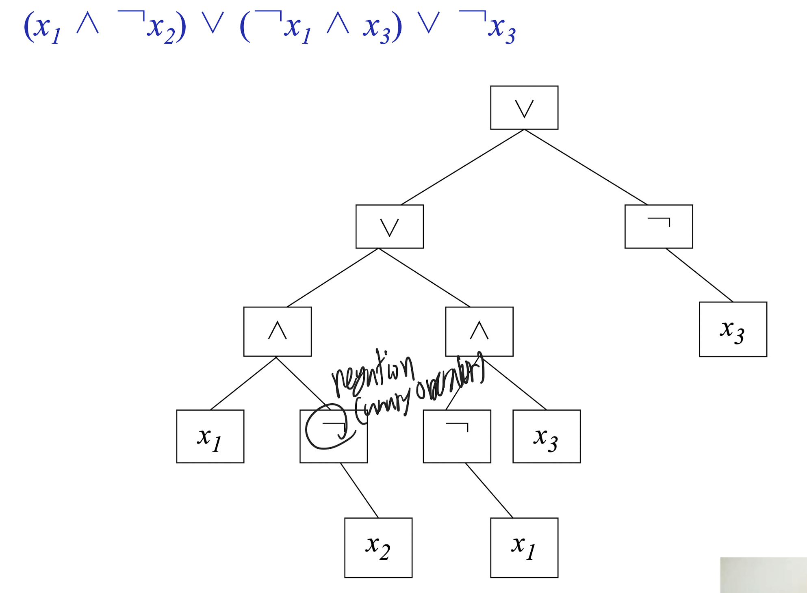
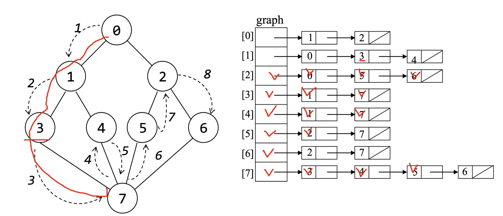

# 기말 대비 정리

## Tree

Complete binary tree를 배열로 구성하면 인덱스로 부모, 자식 노드를 찾을 수 있다.

- 부모 노드: `i/2`
- 왼쪽 자식 노드: `2i`
- 오른쪽 자식 노드: `2i+1`

### Tree Traversal

inorder 기준으로 설명하자면 아래와 같다.

- 재귀로 구현하려면 왼쪽 자식 노드를 먼저 방문하고 자기 자신을 방문하고 오른쪽 자식 노드를 방문한다.
- 반복으로 구현하려면 왼쪽 자식 노드을 모두 스택에 넣고 자기 자신을 방문하고 오른쪽 자식 노드를 스택에 넣는다.

나머지는 순서만 바꿔주면 된다.

추가로 level order traversal은 queue를 사용하면 된다. 먼저 자기 자신을 방문하고 자식 노드를 queue에 넣는다. 그리고 queue가 비어있지 않은 동안 반복한다.

### Evaluation of Expression

일단 tree는 오른쪽부터 연산자 기준으로 나누어지면서 구성된다. 이렇게 구성된 tree는 postorder로 traversal하면서 node의 data에 따라 value를 계산하면 된다.

> data는 연산자일 수도 있고 피연산자일 수도 있다.

### Threaded Binary Tree

leftChild가 null이면 inorder predecessor를 가리키고 rightChild가 null이면 inorder successor를 가리킨다.

> predecessor: 이전 노드, successor: 다음 노드

이렇게하면 맨 왼쪽 노드와 맨 오른쪽 노드는 null을 가리키게 된다. 따라서 추가로 dummy node를 만들어서 맨 왼쪽 노드의 leftChild를 dummy node로, 맨 오른쪽 노드의 rightChild를 dummy node로 설정한다. 이때 구현의 편의상 dummy node의 leftChild는 root를 가리키고 dummy node의 rightChild는 자기 자신을 가리키게 한다. 또한 thread로 사용되는 것을 확인하기 위해 추가로 flag를 둔다. 이때 dummy는 둘다 false로 둔다.

이를 순회하는 방법은 다음과 같다.

1. 오른쪽의 Thread가 true이면 오른쪽 노드로 이동한다.
2. 오른쪽의 Thread가 false이면 오른쪽 노드의 왼쪽 자식 노드의 leftThread가 true가 될 때까지 이동한다.

이렇게 successor를 찾을 수 있는데 이를 통해 inorder traversal을 구현할 수 있다.

### Heap

Heap은 complete binary tree으로 Max Heap과 Min Heap이 있다. Max Heap은 부모 노드가 자식 노드보다 크거나 같고 Min Heap은 부모 노드가 자식 노드보다 작거나 같다.

max heap으로 priority queue를 구현할 수 있다. 이때 priority queue는 배열로 구현할 수 있다. 배열의 첫번째 원소는 항상 root가 되고 왼쪽 자식 노드는 `2i`, 오른쪽 자식 노드는 `2i+1`이 된다. 이때 배열의 첫번째 원소는 사용하지 않는다.

#### Heap Insertion

1. 배열의 마지막에 원소를 추가한다.
2. 부모 노드와 비교하면서 부모 노드보다 크면 swap한다.
3. root에 도달하거나 부모 노드가 자식 노드보다 크면 종료한다.

#### Heap Deletion

1. root의 값를 삭제한다.
2. 마지막 원소를 root로 옮긴 후 해당 노드를 삭제한다.
3. 자식 중 큰 값과 비교하면서 자식 노드보다 작으면 swap한다.
4. 맨 마지막 원소에 도달하거나 자식 노드가 부모 노드보다 작으면 종료한다.

### Binary Search Tree

Binary Search Tree는 왼쪽 자식 노드는 부모 노드보다 작고 오른쪽 자식 노드는 부모 노드보다 크다.

#### Searching in BST

1. root부터 시작한다.
2. 찾는 값이 root보다 작으면 왼쪽 자식 노드로 이동한다.
3. 찾는 값이 root보다 크면 오른쪽 자식 노드로 이동한다.
4. 찾는 값이 root와 같으면 종료한다.

이는 재귀 또는 반복으로 구현할 수 있다.

#### Insertion in BST

1. root부터 시작한다.
2. search를 하면서 삽입할 위치를 찾는다.
3. child가 null일 때 까지 찾는다.
4. 해당 node와 크기 비교를 하여 삽입할 위치를 찾는다.
5. 삽입할 위치에 node를 삽입한다.

#### Deletion in BST

3가지 경우가 있다.

1. 삭제할 node가 leaf node인 경우
   1. 그냥 삭제한다.
2. 삭제할 node가 child가 하나인 경우
   1. 삭제할 node의 child를 삭제할 node의 부모 노드와 연결한다.
3. 삭제할 node가 child가 둘인 경우
   1. left subtree의 가장 큰 값을 찾거나 right subtree의 가장 작은 값을 찾는다.
   2. 해당 값을 삭제할 node의 data로 바꾼다.
   3. 해당 값을 삭제한다.
   4. 이떄 삭제한 node가 child node를 가지고 있을 수 있으므로 이는 1, 2번 경우로 처리한다.

## Graph

Graph는 vertex와 edge로 구성된다. vertex는 node, edge는 vertex를 연결하는 선이다. edge는 directed와 undirected로 구분된다. directed edge는 방향이 있는 선이고 undirected edge는 방향이 없는 선이다.

- complete graph: 모든 vertex가 서로 연결된 graph
- multigraph: 두 vertex 사이에 여러 edge가 존재하는 graph
- simple path: vertex를 중복해서 지나지 않는 path
- cycle: 시작 vertex와 끝 vertex가 같은 path
- connected component: 모든 vertex가 연결된 subgraph
- indegree: directed graph에서 vertex로 들어오는 edge의 수
- outdegree: directed graph에서 vertex에서 나가는 edge의 수

### Graph Representation

#### Adjacency Matrix

Adjacency Matrix는 2차원 배열로 구현된다. 이때 2차원 배열의 값은 edge의 weight가 된다. 이때 directed graph의 경우 row sum는 outdegree가 되고 column sum은 indegree가 된다.

#### Adjacency List

Adjacency List는 linked list로 구현된다. 이때 linked list의 값은 edge의 weight가 된다. 이때 directed graph의 경우 list의 길이는 outdegree가 되고 vertex의 indegree는 list의 길이가 된다.

#### Sequential Representation

Sequential Representation는 1차원 배열로 구현된다. 첫 부분은 각 vertex 별로 adjacent node의 위치를 저장하고 그 다음 부분은 adjacent node의 값이 저장된다.

#### Adjacent Multilist

하나의 list는 자기가 있는 첫 edge node를 가리키고 edge node를 가지고 있는 list가 따로 있다. 이때 edge node에는 연결되는 vertex와 다음 edge node를 가리키는 포인터가 있다.

### Graph Traversal

아래 두 방법으로 connected component를 찾을 수 있다.

#### Graph DFS

DFS는 adjacency list와 재귀로 구현 가능하다. 이때 visited를 체크하여 cycle을 방지한다. 이때 재귀를 사용하는데 돌아가는 방식은 다음과 같다.

1. 현재 vertex를 방문한다.
2. visited를 체크한다.
3. 현재 vertex의 adjacent vertex를 찾는다.
4. adjacent vertex가 visited가 아니면 해당 vertex로 이동한다.
5. adjacent vertex가 visited이면 다음 adjacent vertex를 찾는다.
6. adjacent vertex가 없으면 종료한다.
7. 따라서 이전에 호출한 함수로 돌아간다.

#### Graph BFS

queue를 사용하여 구현한다. 이때 visited를 체크하여 cycle을 방지한다. 돌아가는 방식은 다음과 같다.

1. 현재 vertex를 방문한다.
2. visited를 체크한다.
3. queue에 현재 vertex를 넣는다.
4. queue가 비어있지 않으면 queue의 첫번째 vertex를 꺼낸다.
5. 해당 vertex의 adjacent vertex를 찾는다.
6. adjacent vertex가 visited가 아니면 queue에 넣는다.
7. 이를 반복한다.

### Biconnected Component

biconnected graph는 한 정점을 끊으면 두 개 이상으로 나눠지는 articular point가 없는 graph이다. 이를 구하는 방법은 다음과 같다.

1. root를 정한다.
2. root부터 depth first numbering을 한다.(DFS)
3. 각 vertex의 low number를 구한다.
   1. low number는 dfn, 자식의 low number, back edge의 low number 중 가장 작은 값이다.
   2. child low number가 필요하므로 child부터 low number를 구한다.
4. root의 자식이 2개 이상이면 articular point이다.
5. 자식의 low number가 자신의 dfn보다 크거나 같으면 articular point이다.

## Spanning Tree

Spanning Tree는 graph의 모든 vertex를 포함하면서 cycle이 없는 subgraph인데 하나의 edge만 추가하면 cycle이 생기는 graph이다.

### Minimum Spanning Tree

Minimum Spanning Tree는 edge의 weight의 합이 최소인 spanning tree이다. 이를 구하는 대표 알고리즘은 Kruskal Algorithm, Prim Algorithm이 있다. 이때 기본이되는 알고리즘은 Greedy Algorithm이다.

#### Kruskal Algorithm

1. 모든 edge를 weight가 작은 순서대로 정렬한다.
2. 정렬된 edge를 하나씩 선택한다.
3. 선택한 edge가 cycle을 만들지 않으면 선택한다.
4. 모든 vertex가 선택될 때까지 2, 3을 반복한다.

#### Prim Algorithm

1. 임의의 vertex를 선택한다.
2. 선택한 vertex와 연결된 edge 중 weight가 가장 작은 edge를 선택한다.
   1. 단 선택된 vertex가 아니어야한다.
3. 선택한 vertex를 선택된 vertex로 추가한다.
4. 모든 vertex가 선택될 때까지 2, 3을 반복한다.

선택한 vertex를 따로 저장하여 cycle 여부를 확인하지 않아도 된다.

## Shortest Path

대표적인 알고리즘은 Dijkstra Algorithm가 있다.

### Dijkstra Algorithm

1. 일단 cost에 해당하는 배열을 만든다. 이때 배열의 row는 vertex, column은 vertex의 adjacent vertex으로 값은 edge의 weight가 된다.
2. 시작 vertex를 정하고 direct edge의 cost를 distance에 저장한다.
3. distance중 가장 작은 값을 선택한다.(단 이미 선택된 vertex는 제외한다.)
4. 선택된 vertex의 adjacent vertex의 distance를 구한다.
   1. 해당 adjacent distance와 선택된 vertex의 distance을 더 한 값이 direct distance보다 작으면 해당 adjacent distance를 direct distance로 바꾼다.
5. 모든 vertex가 선택될 때까지 3, 4를 반복한다.

## Sorting

- Insertion Sort: 삽입 정렬
  - 배열 맨 앞은 비우고 두번째부터 시작한다.
  - 맨 앞은 임시 저장소로 사용한다.
  - 2번째 값부터 시작하여 앞의 값과 비교한다.
- Bubble Sort: 버블 정렬
  - 인접한 두 값을 비교하여 큰 값을 뒤로 보낸다.
  - 맨 뒤는 정렬이 된 값이므로 제외한다.
  - 이를 반복한다.
- Selection Sort: 선택 정렬
  - 배열의 맨 앞부터 시작한다.
  - 앞은 정렬이 된 값이므로 제외한다.

### Divide and Conquer Sorting

- Quick Sort: 퀵 정렬
  - pivot을 정한다.
  - pivot을 기준으로 작은 값은 왼쪽, 큰 값은 오른쪽으로 보낸다.
  - 이를 반복한다. (재귀)
- Merge Sort: 병합 정렬
  - 배열을 반으로 나눈다.
  - 나눈 배열을 정렬한다.
  - 정렬된 배열을 합친다.
  - 교안에서는 나누는 과정은 없고 이미 쪼개진 배열을 합치는 과정만 있다.

### Heap Sort

- Max Heap으로 만든다.
- Max Heap의 root와 마지막 값을 바꾼다.
- Max Heap의 마지막 값을 제외하고 다시 Max Heap으로 만든다.
- 이를 반복한다.

## Hashing

### Hash Function

- Division Method: 나눗셈을 이용한 방법
  - key를 table size로 나눈 나머지를 반환한다.
- Mid Square Method: 제곱을 이용한 방법
  - key를 제곱한 후 중간의 몇 비트를 반환한다.

### Open Addressing

- Linear Probing: 선형 조사법
  - 충돌이 발생하면 다음 index를 조사한다.
- Random Probing: 무작위 조사법
  - 충돌이 발생하면 무작위 index를 조사한다.

삭제되면 tombstone을 남긴다. 담에 검색할 때 tombstone이면 무시한다. 삽입할 땐 tombstone이면 그 자리에 삽입한다.

### Chaining

- Linked List를 사용하여 충돌을 해결한다.
