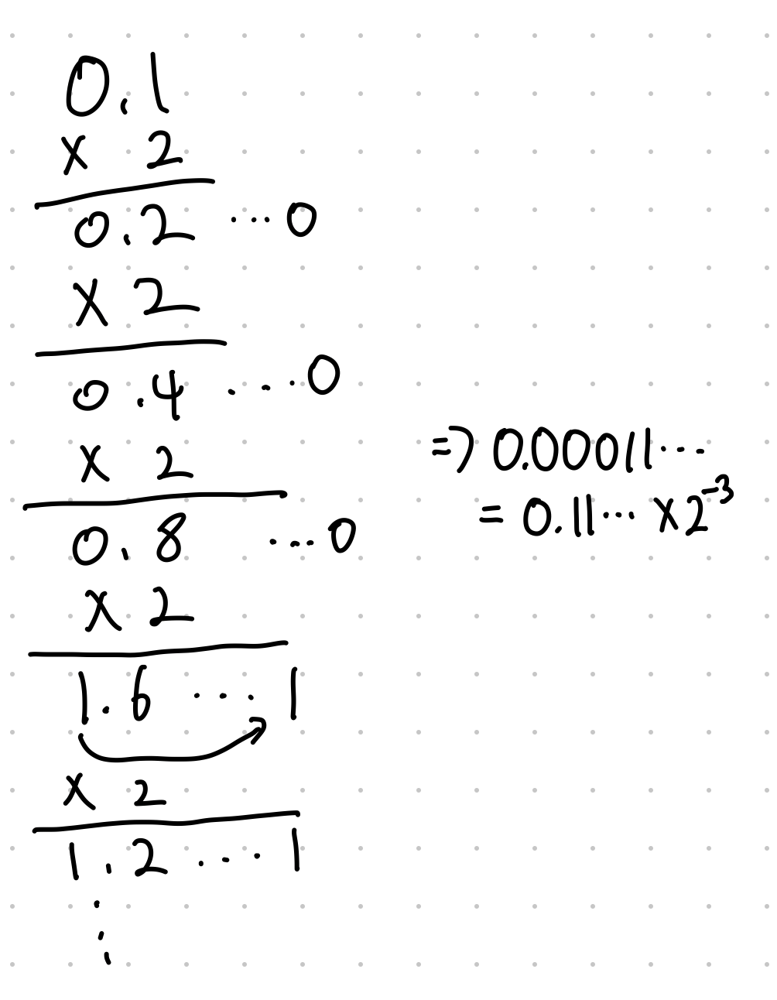

# 시스템프로그램 3주 차

## Integer Arithmetic

### Unsigned addtion

x + y의 결과가 2^(w-1) 유효범위보다 크게 되면(overflow) 2^w를 뺀 결과를 저장한다.

### Signed addition

Signed integer도 유효범위를 넘어가는 overflow 현상이 일어날 수 있다. Signed는 Positive overflow와 Negative overflow가 발생하는데 Positive는 2^w를 뺀 값이 저장되고 Negative는 2^w를 더한 값이 저장된다. (leading carring bit이 떨어져 나감)

|x|y|x+y|result|
|-|-|-|-|
|-8|-5|-13|3|
|-8|5|-3|-3|
|5|5|10|-6|

4-bit integers는 -8~7까지 표현할 수 있으므로 위와 같은 결과가 나온다. 첫 번째는 negative overflow의 예시 세 번째는 positive overflow의 예시이다.

### 2's complement negation

2's complement의 유효범위를 보면 음수가 절댓값 기준 하나 더 표현할 수 있기 때문에 negation 연산을 수행하면 overflow 문제가 발생할 수 있다.

> e.g. 4bit일 땐 -8(1000)을 negation 하면 똑같이 -8(1000)이 된다. (XOR 1000 + 1 = 0111 + 0001 = 1000)

### Unsigned & 2's complement multiplication

Unsigned integers  x, y를 곱한 값을 다 표현하려면 2^w bits가 필요하다. 하지만 w bits만 가지고 있기 때문에 low-order w bits 외에는 버리게 된다.

2's complement도 똑같이 low-order w bits 외에는 버리게 되지만 2's complement로 해석한다는 점 차이밖에 없다.

### Multiplying by constants

`x * 2^k == x << k`이기 때문에 컴파일러는 multiplying으로 수행하지 않고 bit shift로 수행하게 된다.

왜냐하면 multiplying은 10개 이상의 clock이 필요하지만, shift, add, sub은 1 clock cycle만 필요하기 때문에 성능상 이점을 위해 shift, add, sub의 조합으로 변환해서 수행한다.

> e.g. x * 14 == x << 3 + x << 2 + x << 1

### Division

multiplication 보다 더 느리다. (30 이상의 clock cycle) 따라서 multiplication처럼 right shift로 바꾸는데 다만 2^k로 나눌 때만 가능하다.

- unsigned일 경우 오른쪽으로 shift 한 만큼의 low-order bits는 버려지기 때문에 소수점 버림이 되고 왼쪽에 빈 bit는 0으로 채워진다.
- signed도 똑같이 shift를 하고 왼쪽은 sign bit로 채워진다. 다만 음수일 경우 x를 향해 round가 되게 보정할 필요가 있어서 (x+2^k-1) / 2^k 연산을 수행하는데 bit로 따지면 기존 x / 2^k 결과에서 1을 더한 것과 같다.

## Floating Point

아주 작거나 큰 숫자를 표현하기 위한 방법이다.

|Sign|Exponent 지수|Fraction 가수|
|-|-|-|

위와 같이 bit듯이 구성되게 된다.

### Example - 1



0.1을 2진수로 나타내면 0.0001100110011[0011]... 반복과 같다. (0.1에 2를 계속 곱해서 정수 부분이 1되면 또 1을 빼고 0으로 대체해서 계속 나아간다) 여기에 이제 2^-3을 곱해서 (e.g. 0.1100... * 2^-3) 10진수와 유사하게 나타내는 것을 Normalization이라고 한다.

여기서 -3이 exp, 11001100...이 frac, s는 0이다. 이를 16-bits Float Pointing Number로 나타내면 s는 1 bit, exp는 5 bits, frac 10 bits 순서로 나타낼 수 있고 따라서 0/11101/1100110011로 나타낼 수 있다.

### Example - 2

5.1 = 5 + 0.1 이기 때문에 2진수로 표현하면 101.000110011...이다. 이번에는 정수가 있으므로 오른쪽으로 shift를 한다. 따라서 0.101000110011.. * 2^3이라고 할 수 있다. 이를 또 16-bits FPN로 나타내면 0/00011/1010001100이다.

> 0.1111...(binary) == 1/2 + 1/4 + 1/8 + 1/16...와 같고 1.0 바로 아래의 수와 같고 표기는 1.0 - 앱실론이라고 한다.

### Representable numbers

정확하게 표현할 수 있는 수는 x/2^k이고 아닌 수는 일정 bit가 계속 무한 반복된다.

## IEEE Standard 754

V = x * 2^y 형태의 숫자들을 encode 하는 목적으로 사용되면 1985년에 IEEE Standard 754를 제정하고 업데이트해나갔다. 앞으로 해당 표준이 어떻게 floating number를 표현하는지 알아볼 것이다.

숫자를 표현하는 방식은 -1 ^ s \* M * 2 ^ E이다.

- negative이면 s = 1, postive 이면 s = 0
- Significand(frac) M은 [1, 2) 범위를 가진다.
  - IEEE Standard 754는 앞서 설명한 방식과 달리 bit를 1.xxxx 까지 당겨서 표현한다.
  
### Sizes

- sign bit은 공통으로 1 bit
- Single precision (float, 32-bit FP)
  - 8 exp bits, 23 frac bits (32bits total)
- Double precision (double, 64-bit FP)
  - 11 exp bits, 52 frac bits (64bits total)

### Encoding

3가지 경우가 있다.

- Normalized
  - exp 부분이 모두 0과 1이 아니면
- Denormalized
  - exp 부분이 모두 0이면
- Infinity, NaN
  - exp 부분이 모두 1이면
  - infinity은 frac이 모두 0 일때
  - NaN은 0이 아닐때

#### Normalized

실제 Exponent가 negative이면 Bias만큼 더해서 positive로 Exp에 표현하는게 더 쉽기 때문에 항상 Bias만큼 더해서 저장한다. 따라서 실제 Exponent는 표현된 Exp에서 Bias만큼 뺀 값이 된다.

> Bias: 2^(k-1) - 1
> e.g. Single Precision: 127, DP: 1023

fraction(M, Significand) 쪽은 1.xxxx로 명시되어 있지만 실제 fraction은 xxxx 부분이다.

``` c
float f = 2003.0;
```

일 때 2003 = 11111010011b = 1.1111010011b * 2^10이다. 따라서 frac은 11110100110...b, Exp = 10 + 127 = 137 = 10001001b이다.

#### Denormalized

exp는 앞서 설명한 것처럼 0으로 채워져 있고 M이 leading 1이 없고 0.xxxx로 표현된다. Exponent value(실제 지숫값)는 무조건 1 - Bias이다.

 만약에 exp=000..0b, frac=000..0b 일 경우 0이고 sign bit에 따라 +0과 -0이 존재한다. 만약에 frac!= 0.000...0b 일 경우엔 0.0에 매우 가까워진다 (Gradual underflow).

### Tiny FP example

예시를 들기 편하도록 8 bits로 줄여서 예제를 보여주셨다. exp는 4 bits (bias = 7(2^3-1)), frac는 3 bits로 가정했다.

0 0000 000 ~ 0 000 111까지 Denormalize, 0 0001 000 ~ 0 1110 111까지가 Normalize 나머지 0 1111 ~는 Special Value이다. 0 000 111은 7/512이고 0 001 000은 8/512인 것을 볼 때 denormalize 와 normalize 덕분에 자연스럽게 넘어가는 것을 알 수 있다.

> e.g. 01110000b = 1\*2^7 = 128, 00000001b = 1/8 * 2^-6
