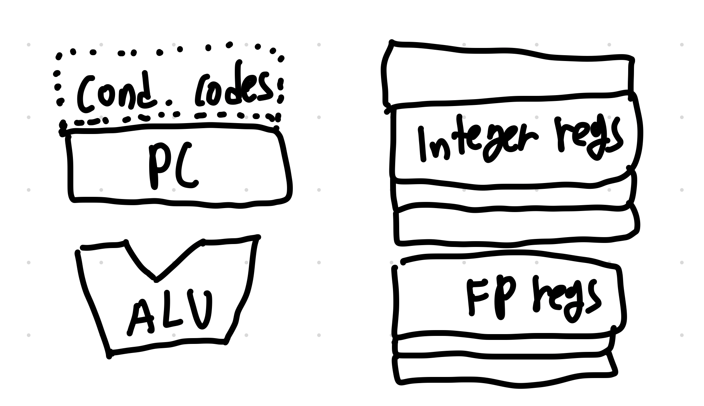

# 시스템 프로그램 4주 차

## Floating Point

### Special properties

- FP zero(All bits = 0)는 integer zero와 같다.
- FP number끼리 비교는 그냥 unsigned integer comparison처럼 해도 된다.
  - 다만 sign bit는 제일 먼저 비교를 해야한다.
  - NaN은 sign bit을 제외한 모든 비트가 1이기 때문에 모든 수보다 커 보이기 때문에 따로 이 경우를 처리하는 부분이 필요

### Rounding

표현할 수 없는 숫자가 나왔을 때 최대한 근사치를 저장하기 위한 수법으로 IEEE FP에는 4가지 다른 rounding mode가 있다.

- Round-to-even (round-to-nearest)
  - 흔히 말하는 반올림
  - Default
  - 만약에 딱 가운데일 경우엔 LSB가 짝수(even)인 곳으로 간다.
  - 참고로 LSB가 0일 때 짝수, 1일 때 홀수라고 한다.
  - e.g. 1.5 -> 2, 2.5 -> 2
- Round-toward-zero
  - 0으로 가면서 가까운 수
  - 절댓값이 작은 곳으로
- Round-down
  - 무조건 아래
- Round-up
  - 무조건 위로

### FP Operation

#### FP Multiplication

sign끼리 XOR 연산하고 Significand 끼리 곱 연산 후에 Round 과정을 거치고 Exponent끼리 더하면 FP multiplication을 수행할 수 있다.

#### FP Addition

Exponent를 큰 쪽으로 맞추고 맞춘 만큼 Fraction은 오른쪽으로 shift를 하고 add를 하면 된다.

#### FP operations: Some properties

- FP addition, multiplication are not associative
  - e.g. (3.14 + 1e10) - 1e10 = 0.0 (3.14는 rounding 때문에 사라짐), 3.14 + (1e10 - 1e10) = 3.14
  - e.g. (1e20 \* 1e20) *1e-20 = infinity, 1e20*(1e20*1e-20) = 1e20
- FP addition satisfies monotonicity
- FP multiplication does not distribute over addtion

대부분이 유효범위 때문에 발생하는 특성들이다.

### FP in C

- Type conversions
  - int to float
    - round 발생 가능성
  - int or float to double
    - 똑같이 전환
  - double to float
    - overflow 또는 round 발생 가능성
  - float or double to int
    - rounded to ward 0 또는 overflow 가능성

## Machine-level Representation of Programs

### Introduction & Program Encodings

#### Assembly code

Assembly code를 읽을 수 있으면 컴파일이 최적화 하기 좋은 코드를 작성할 수 있고 코드의 취약성을 이해할 수 있다.

앞으로 배울 부분은 언어는 C언어, 시스템은 x86-64, OS는 linux, 컴파일러는 gcc 기준으로 한다.

- IA 32
  - 32-bit machine
  - 4GB of mem 지원
- x86-64
  - 64-bit machine
  - 256TB(2^64B) of mem 지원

#### Machine-level code: Some comments

machine code에는 따로 데이터 타입이 없고 오직 기초적인 operation만 지원하고 가상 주소를 사용해서 저장하고 이를 MMU가 Physical address로 mapping해서 저장한다.

#### Compilation System

``` zsh
gcc -Og -o p p1.c p2.c
```

- -Og
  - 최적화 단계를 의미
  - Og는 기본 따라서 original source code를 그대로 따라서 machine code를 만든다.
  - -O1, -O2는 각각 Level-1 opt, Level-2 opt이다.

Optimization의 level을 증가시킬수록 빨리 실행되지만, 컴파일 속도가 느려지고 생성된 machine code를 이해하기 점점 어려워진다. 따라서 디버깅 단계에서는 Og를 사용하고 최종 빌드 단계에서는 level of optimization을 높인다.

``` zsh
gcc -Og [-S] [-c] mstore.c
```

- -S는 assembly code로 변환하는 과정까지 실행
- -c는 pre-compiling과정 까지만 실행

``` zsh
objdump -d mstore.o
```

object 파일을 assembly code로 된 파일로 disassembling하는 명령어이다.

#### ISA

SW와 HW 사이에 껴 있는 Instruction Set Architecture(ISA)는 내가 만든 기계어들이 순서대로 실행한다고 SW Level에 보여준다.

#### Processor state



> 발그림...

- PC (Program Counter)
  - 다음번 실행할 명령어를 저장해둔다.
  - register 이름 x86-64에선 % rip이다.
- Condition code regs
  - eflag라고도 부름
  - ALU가 가장 최근에 연산한 status information을 저장
  - conditional change 또는 data flow에 사용된다.

### Data Format

인텔에서는 16-bit을 Word, 32를 Double word 그리고 64를 Quad word라고 한다. 따라서 인텔 문서를 볼 때는 흔히 말하는 32-bit를 word라고 하지 않기 때문에 조심해야 한다.

Assembly code 뒤에 붙은 suffix는 데이터의 크기를 나타낸다. 예를 들어 movb는 1byte, movw는 2 bytes, movl는 4 bytes, movq는 8 bytes를 나타낸다.

### Intel processors

CISC Machine으로 매우 많은 포맷들을 가진 많은 instruction 들을 가지고 있다. old features도 호환성을 위해 여전히 지원하고 있다.

SSE(Streaming SIMD Extensions)을 지원한다.

> SSE는 x86 architecture의 SIMD Instruction set extension이다.

HTT(Hyper Threading Technologies)도 지원하는데 각 코어가 2개의 가상 혹은 논리적인 thread를 가진 것처럼 만드는 것을 말한다.

### Accessing Information

- Application programming Regs (64-bit)
  - Integer
    - %r(a~d)x, %rsi, %rdi, %rbp, %rsp, %r(8~15)
    - r대신 e를 붙이면 low order 32-bit를 설정 가능, r8부터는 뒤에 d를 붙이면 됨
    - 다른 suffix를 붙이면 더 low order 한 bit 들도 설정 가능
    - 총 16개
  - FP
    - %ymm0 ~%ymm15
    - 총 16개
  - %rip
    - Program Counter
  - EFLAGS
  - Segment regs는 이번 수업에선 다룰 일이 없다.

#### Special rules on using registers

연산은 각 연산의 크기에 맞게 LSB 기준으로 접근할 수 있고 저장할 때 low-order쪽 부터 채워지고 남은 공간은 건들지 않는다. 다만 4 bytes 이상은 나머지를 0으로 초기화한다.

%rsp는 stack pointer로써 stack의 top position을 지시하는 데 사용한다. 따라서 해당 regs 에 이상한 값을 넣으면 프로그램이 정상적으로 작동하지 않을 수 있다. 이 외의 regs 들도 각각 특정한 역할을 한다.

#### EFLAGS regs

- Carry Flag (CF)
  - arithmetic operation을 했을 때 unsigned integer 기준으로 overflow가 발생하면 1이 된다.
- Overflow Flag (OF)
  - Carry Flag의 signed integer 버전
- Sign Flag (SF)
  - 연산의 결과의 MSB로 설정
- Zero Flag (ZF)
  - 최근 연산이 0되면 1

#### %rip regs

다음에 실행될 instruction을 위한 code segment의 주소를 저장한다. SW적으로 직접 접근할 regs는 아니다.

#### FP regs

SSE에서는 128-bits(%xmm)를 가지고 AVX에서는 256-bits(%ymm)를 가진다.

### Primitive Instructions

- Operand Specifiers
  - Immediate
    - Prefix $
    - e.g. $15
  - Register
    - Register name
  - Memory
    - Imm(Eb,Ei,s)식으로 메모리 지정
    - 이를 통해 Imm + R[Eb] + s*R[Ei]값을 얻는다.
    - Imm: offset, Eb: base regs, EiL index regs, s: scale factor

#### Operand specifiers: Example

|Expression|Computation|Address|
|-|-|-|
|0x8 (%rdx)|0xf00 + 0x8|0x0000f008|
|(%rdx, %rcx)|0xf000 + 0x0100|0x0000f100|
|(%rdx,%rcx,4)|0xf000 + 4*0x0100|0x0000f400|
|0x80 (,%rdx,2)|2*0xf000 + 0x80|0x0001e080|
