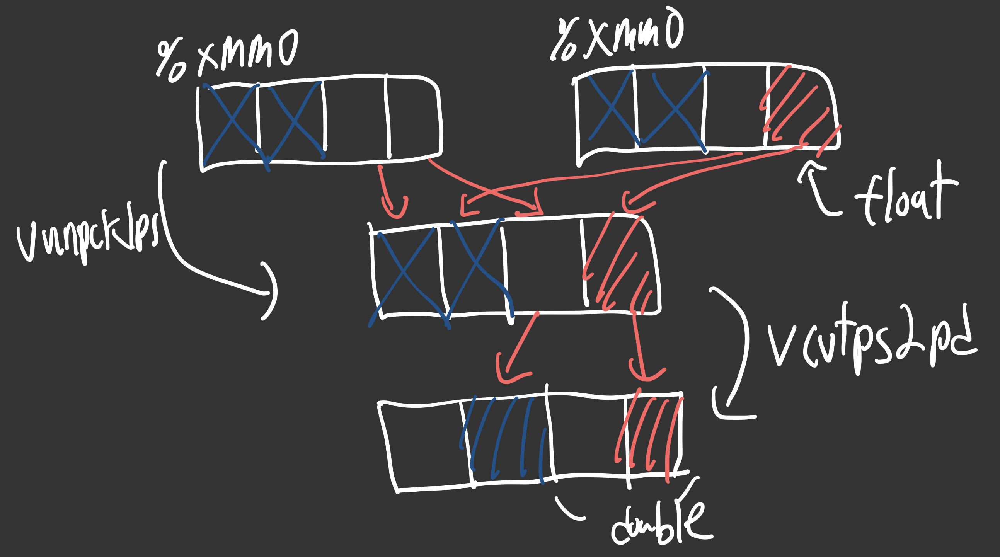
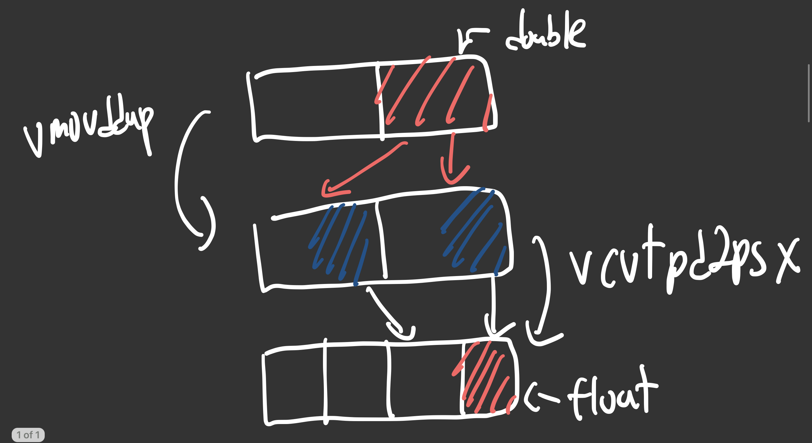

# 시스템 프로그램 9주 차

## FP Operations

1997년 펜티엄에서 MMX(Media instructions)이 출시하면서 SIMD가 등장하고 시간이 흘러 이를 확장한 AVX가 나오면서 YMM register가 등장했다. ymm은 256bit이고 xmm은 이 중 128bit만을 사용한다. 해당 FP regs(Media regs라고도 함)는 총 16개가 있다.

해당 regs는 scalar data를 운용할 땐 오직 FP data만 다루고 float일 땐 lower-order 32bits, double일 땐 lower-order 64bits만 사용한다.

> vector data를 운용할 땐 정수도 다룰 수 있다.

해당 regs로 다룰 수 있는 data의 종류는 scalar와 pacekd(vector)가 있는데 각 연산자에도 차이가 있다. scalar는 1개의 data를 다루고 packed는 여러 개의 data를 다룬다.

### FP movement

일단 기본적으로 v-prefix가 전체적으로 붙어 있는데 그 뒤에는 scalar와 packed의 구분 single precision과 double precision의 구분이 있다.

| Instruction | Source   | Destination | Description                           |
| ----------- | -------- | ----------- | ------------------------------------- |
| vmovss      | M32 or X | X or M32    | Move scalar single precision          |
| vmovsd      | M64 or X | X or M64    | Move scalar double precision          |
| vmovaps     | X        | X           | Move aligned, packed single precision |
| vmovapd     | X        | X           | Move aligned, packed double precision |

> X: XMM register, M32: 32bit memory, M64: 64bit memory

### FP conversion

#### FP conversion (FP -> Integer)

| Instruction | Source | Destination | Description                                              |
| ----------- | ------ | ----------- | -------------------------------------------------------- |
| vcvttss2si  | X/M32  | R32         | Convert with truncation single precision to integer      |
| vcvttsd2si  | X/M64  | R32         | Convert with truncation double precision to integer      |
| vcvttss2siq | X/M32  | R64         | Convert with truncation single precision to quad integer |
| vcvttsd2siq | X/M64  | R64         | Convert with truncation double precision to quad integer |

> R32: 32bit register, R64: 64bit register
> Perform truncation, rounding values toward zero

#### FP conversion (Integer -> FP)

| Instruction | Src1    | Src2 | Destination | Description                              |
| ----------- | ------- | ---- | ----------- | ---------------------------------------- |
| vcvtsi2ss   | M32/R32 | X    | X           | Convert integer to single precision      |
| vcvtsi2sd   | M64/R64 | X    | X           | Convert integer to double precision      |
| vcvtsi2ssq  | M32/R32 | X    | X           | Convert quad integer to single precision |
| vcvtsi2sdq  | M64/R64 | X    | X           | Convert quad integer to double precision |

> 수업에서는 Src2는 무시해도 좋다. 따라서 그냥 Destination와 똑같은 값을 넣어준다.

#### FP conversion Example

```assembly
vcvtsi2sdq %rax, %xmm1, %xmm1
```

%rax에 있는 long data를 double precision으로 변환해서 %xmm1에 넣는다.

```assembly
vcvtss2sd %xmm0, %xmm0, %xmm0
```

%xmm0에 있는 single precision을 double precision으로 변환해서 %xmm0에 넣는다. 이는 아래와 같이도 나타낼 수 있다.

```assembly
vunpcklps %xmm0, %xmm0, %xmm0
vcvtps2pd %xmm0, %xmm0
```



vunpcklps는 S1, S2의 high-order 4bytes는 날리고 나머지 2bytes씩 순서대로 Destination에 넣는다. 예를 들어 S1 = (s3,s2,s1,s0) 이고 S2 = (t3,t2,t1,t0) 이면 D에는 (s1,t1,s0,t0)이 들어간다. vcvtps2pd는 S의 low-order 2bytes씩 나누어 double precision으로 변환해서 Destination에 넣는다. 예를 들어 S = (s3,s2,s1,s0) 이면 D에는 (ds1,ds0)이 들어간다.

```assembly
vcvtsd2ss %xmm0, %xmm0, %xmm0
```

%xmm0에 있는 double precision을 single precision으로 변환해서 %xmm0에 넣는다. 이는 아래와 같이도 나타낼 수 있다.

```assembly
vmovddup %xmm0, %xmm0
vcvtpd2psx %xmm0, %xmm0
```



vmovddup은 S의 low-order 4bytes 즉 double-precision value를 2번 반복해서 Destination에 넣는다. 예를 들어 S = (ds1,ds0) 이면 D에는 (ds0,ds0)이 들어간다. vcvtpd2ps는 2개의 double-precision values을 single-precision으로 변환해서 regs의 절반에 집어넣고 나머지 절반을 0으로 채워서 Destination에 넣는다. 예를 들어 S = (ds1,ds0) 이면 D에는 (0,0,s1,s0)이 들어간다.

> 강조하고 넘어가셨다. 아마 퀴즈에 나오지 않을까?

### FP code for procedures

- 8 FP arguments는 XMM0 ~ XMM7에 넣는다.
  - 그 외에는 stack에 넣는다.
- FP value을 return 할 때에는 XMM0에 넣는다.
- XMM regs는 모두 caller-saved

### FP Arithmetic

| Single | Double | Effect          | Description |
| ------ | ------ | --------------- | ----------- |
| vaddss | vaddsd | D = S2 + S1     | Add         |
| vsubss | vsubsd | D = S2 - S1     | Subtract    |
| vmulss | vmulsd | D = S2 \* S1    | Multiply    |
| vdivss | vdivsd | D = S2 / S1     | Divide      |
| vmaxss | vmaxsd | D = max(S2, S1) | Maximum     |
| vminss | vminsd | D = min(S2, S1) | Minimum     |
| sqrtss | sqrtsd | D = sqrt(S1)    | Square root |

> S1은 memory나 register, S2와 D는 register만 가능하다.

double과 float을 연산하기 위해서는 float을 double로 변환하는 과정이 필요하다.

#### Defining and using FP constants

FP는 immediate value로 사용할 수 없고 다른 상수 값으로 정의해서 memory에 저장해야 한다.

```c
double cel2fahr(double temp){
  return 1.8 * temp + 32.0;
}
```

```assembly
# temp = %xmm0
cel2fahr:
  vmulsd .LC2(%rip), %xmm0, %xmm0
  vaddsd .LC3(%rip), %xmm0, %xmm0
  ret
.LC2:
  .long 3435973837 # low-order 4bytes of 1.8
  .long 1073532108 # high-order 4bytes of 1.8
.LC3:
  .long 0 # low-order 4bytes of 32.0
  .long 1077936128 # high-order 4bytes of 32.0
```

> intel은 little-endian이다. 따라서 low-order 4bytes가 먼저 나온다.

위와 같이 label을 붙여서 상수를 정의하고 사용할 수 있다.

### FP bitwise

| Single | Double | Effect      | Description |
| ------ | ------ | ----------- | ----------- |
| vxorps | vxorpd | D = S2 ^ S1 | XOR         |
| vandps | vandpd | D = S2 & S1 | AND         |

Destination Regs의 전체를 수정한다.

#### FP bitwise Example

```c
double simp(double x){
  return -x;
}
```

```assembly
# x = %xmm0
simp:
  vmovsd .LC2(%rip), %xmm1
  vxorpd %xmm1, %xmm0, %xmm0
  ret
.LC2:
  .long 0 # low-order 4bytes of -0.0
  .long -2147483648 # high-order 4bytes of -0.0
  .long
  .long
```

위와 같이 bitwise 연산을 통해 간단하게 -x를 구할 수 있다.

### FP compare

| Instruction    | Based on | Description              |
| -------------- | -------- | ------------------------ |
| ucomiss S1, S2 | S2 - S1  | Compare single precision |
| ucomisd S1, S2 | S2 - S1  | Compare double precision |

CMP instruction과 비슷하게 ZF, CF을 Set하는데 추가로 PF(Parity Flag)를 Set한다.

- S1 또는 S2가 NaN이라서 비교할 수 없는 경우
  - Set PF to 1
- S2 < S1
  - Set CF to 1
- S2 = S1
  - Set ZF to 1
- S2 > S1
  - Set CF to 0

위 4가지 경우를 중심으로 생각하면 된다.

## Optimizing Program Performance

지금까진 instruction에 대해 알아보았는데 이는 지금부터 배울 optimization을 위해 공부한 것으로 지금부터 본론이라고 생각하면 된다.

### Introduction

program code는 아래 3가지 성질을 가져야 한다.

- Correctness
  - 프로그램이 정확하게 동작해야 한다.
- Clear and concise
  - 프로그램이 명확하고 간결해야 한다.
- Efficient
  - 프로그램이 효율적이어야 한다.
  - 우리가 앞으로 배울 중요한 성질이다.

효율적인 program code는 적절한 자료구조와 알고리즘을 선택하거나 compiler가 더 효율적으로 optimize할 수 있도록 작성하거나 parallel하게 동작할 수 있도록 작성하는 것이다.

다만 빠르게 작동할 수 있도록 하다보면 코드가 복잡해지고 이는 구현과 유지보수를 어렵게 만든다. 즉 Trade-off가 존재한다. 보통 응용 프로그램 단계에서는 유지보수가 쉽게 작성하고 시스템 프로그램 쪽은 성능을 우선시하는 경향이 있다.

효율적인 program code을 짜는 기술로는 2가지 종류가 있다.

- Target machine independent
  - 불필요한 일을 하지 않도록 한다.
  - e.g. function call, contitional tests, memory access
- Target machine dependent
  - 현대 프로세서의 구조와 특성을 이해하고 이를 활용해 효율적인 program code를 짠다.
  - e.g. parallel processing, out-of-order execution, pipelining, cache memory

#### Code Optimization

보통 straightforward하게 최적화는 할 수 없고 trial-and-error를 통해 최적화를 진행한다. 좋은 전략으로는 아래와 같은 것들이 있다.

- Inner loop inspection
- Parallelism detection by identifying critical paths

> Critical path는 가장 오래 걸리는 path를 의미한다.

### Optimizing Compilers

gcc 같은 경우에는 cli option을 통해 optimization level을 둘 수 있는데 우리는 -O1 즉 레벨 1을 사용할 것이다. Compiler가 optimization을 하기 쉽도록 짜면 O1만으로도 충분히 최적화가 가능하다.

Compiler는 완전히 똑같은 행동을하는 코드로만 optimization을 진행한다. 그래서 보통 전형적인 optimization blockers가 존재한다.

- Memory aliasing
  - 포인터를 통해 같은 메모리를 가리키는 경우
- Procedure side effects
  - 함수가 외부의 변수를 변경하는 경우

두가지 경우에는 compiler가 optimization을 진행할 수 없다. 따라서 개발자가 잘 판단해서 최적화를 진행하는 것이 좋다.

### Expressing Program Performance - CPE

CPE는 Cycle Per Element의 약자로서 하나의 element를 처리하는데 걸리는 cycle의 평균을 의미한다. 이는 아래와 같이 표현할 수 있다. 이와 비슷한 CPI(Cycle Per Instruction)도 존재한다.

보통 CPE로 Total time을 구하면 a \* n + b인데 a는 CPE, b는 overhead로 setup 등을 하면서 걸리는 시간이다.

수업에서는 loop unrolling을 통해 CPE를 줄이는 방법을 배웠다. 이는 아래와 같이 표현할 수 있다. loop unrolling은 loop의 iteration을 줄이는 것이다.

### Loop Optimization

앞으로 쭉 여러 버전의 function을 만들어가면서 최적화를 진행할 것이다. 이를 위해 구현한 함수는 structure을 사용한 간단한 덧셈 또는 곱셈을 수행하는 함수이다. 여기서 data type은 Integer와 FP를 사용한다.

먼저 첫 번째로 진행한 최적화는 gcc O1 옵션을 사용한 것이다. 이를 통해 약 절반의 cycle을 줄일 수 있었다. 그리고 두 번째로는 loop condition에 있던 연산을 loop 밖으로 빼서 수행하도록 했다. 이는 큰 영향을 주지는 못했다.
