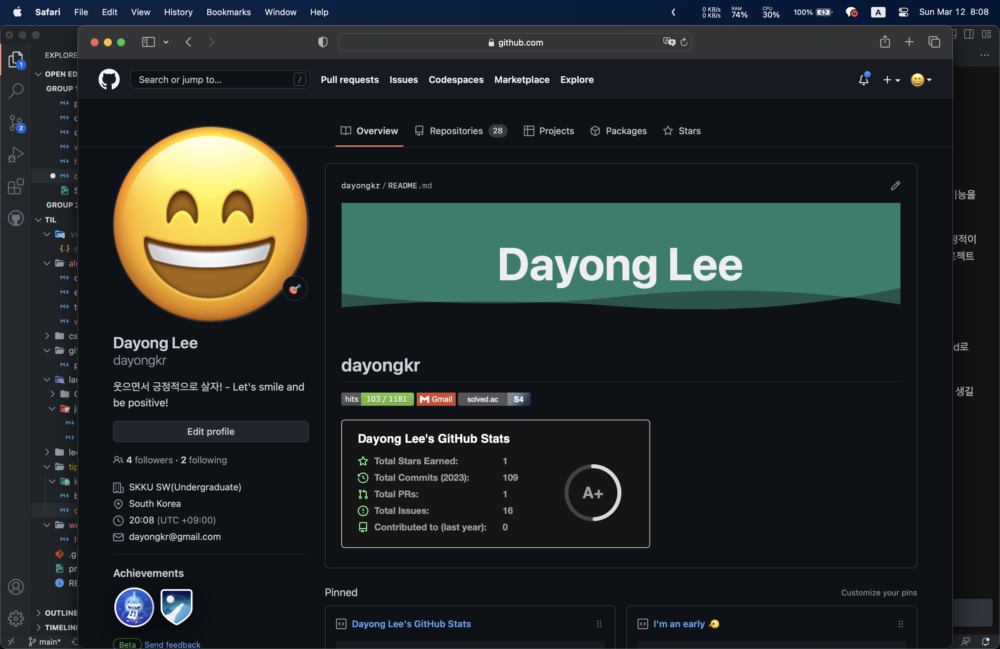

# Github Public Profile Page(README) 꾸미기

역시 개발자들이 만든 Github 답에 자신의 페이지를 소소하게나마 꾸밀 수 있는 기능을 제공한다.

다만 그저 Markdown 파일로 꾸미거나 Gist를 사용해서 꾸며야 하므로 한정적이지만 개발자들이 사용하는 서비스답게 이를 극복할 수 있는 다양한 오픈 소스 프로젝트들이 많다. 이 중에 몇 가지를 오늘 간단히 소개해보려고 한다.

## README.md

일단 시작하기에 앞서 Special repository를 하나 만들어야 한다. 본인의 Github id로 Repo를 만든 후 README.md 파일을 하나 만들어주자.



이제 자신의 [Github 프로필 페이지](https://github.com/dayongkr)에 가면 README.md 내용을 보여주는 칸이 생길 것이다. 즉 README.md 파일을 활용해서 앞으로 꾸며 나가면 된다. 따라서 기본적으로 Markdown을 다루는 방법을 알아야 하는데 어차피 마크업 언어이기 때문에 배우는데 크게 어렵지 않을 것이다.

### README.md - 추천 오픈 소스 프로젝트

#### capsule render - 헤더 꾸미기


텍스트와 배경이 있는 배너을 만들어주는 프로젝트이다.

``` markdown

```

위 코드를 마크다운에 입력을 하면 똑같은 배너을 얻을 수 있고 여기서 몇가지 수정을 한다면 본인 입맛에 맞는 배너을 얻을 수 있다.

- text를 수정하여 배너에 입력할 글자 바꾸기
  - %20을 입력하면 띄어쓰기
- color, fontColor를 각각 수정하여 배경색과 글자색 바꾸기
- height를 수정해서 배너 높이 바꾸기

그 외에 다양한 옵션을 수정할 수 있으니 [keychan99/capsule-render](https://github.com/kyechan99/capsule-render) 제작자의 Repo를 참고해서 입맛에 맞게 커스텀을 해보자

#### Github Stats

[](https://github.com/anuraghazra/github-readme-stats#gh-dark-mode-only)

자신의 Github에 있는 여러 정보들을 보여주는 프로젝트이다.

``` markdown
[](https://github.com/anuraghazra/github-readme-stats#gh-dark-mode-only)
```

해당 프로젝트 역시 위 코드를 그대로 복사 붙여넣기 하고 일부 수정만 하면된다.

- username에 본인 Github name을 입력하여 본인의 정보를 가져올 수 있게 하자.
- theme는 워낙 많기 때문에 [anuraghazra/github-readme-stats](https://github.com/anuraghazra/github-readme-stats)로 가서 원하는 테마를 찾아봐야한다.

#### 백준 티어

[](https://solved.ac/dayongkr)

[](https://solved.ac/dayongkr)

백준을 solved.ac와 연동하여 티어로 나타내주는 프로젝트로 디자인만 다른 2가지 버전과 미니 버전으로 총 3가지 버전이 있다.

``` markdown
<!-- v2.0 -->
[](https://solved.ac/dayongkr)

<!-- 미니 -->
[](https://solved.ac/dayongkr)
```

boj에 자신의 백준 nickname으로 변경해주면 되고 옆에 링크도 똑같이 nickname으로 변경해주면 된다.

> 참고로 해당 solved.ac의 잔디를 가져오는 프로젝트도 있으니 해당 제작자의 github Repo를 참고해보세요!

## Gist

MD 파일을 수정해서 꾸미는 방식 말고 밑에 자신의 Repo와 Gist를 고정할 수 있는 것을 활용해 꾸밈을 더하는 방법이 있다. Gist를 고정하게 되면 Gist의 내용 일부가 보이게 되는데 이를 활용해서 꾸미는 것이다.

근데 일단 Settings -> Developer settings에 가서 토큰을 하나 발행하자. 토큰의 권한은 gist, Repo만 체크하면 된다. 또한 당연히 새로운 Gist을 만들어야 한다. 만들고 나서 주소를 보면 `https://gist.github.com/dayongkr/abcd1234` 이처럼 nickname 뒤에 특정한 문자열이 붙어 있을 텐데 이게 해당 gist를 식별할 수 있는 문자열이다.

> 토큰은 하나만 있어도 되지만 gist는 프로젝트별로 필요하다.

### Gist - 추천 오픈 소스 프로젝트

#### Productive box - 나는 Early Bird인가? Night Owl일까?


Commit한 시간대로 통계를 내서 주행성인지 야행성인지 알려주는 재밌는 프로젝트이다. 다른 프로젝트는 위 마크다운에서 등장했던 프로젝트와 겹치는 부분이 많았지만, 해당 프로젝트는 아이디어가 기발해서 추가했다. 적용 방법은 마크다운 보다는 어렵다.

일단 [techinpark/productive-box](https://github.com/techinpark/productive-box) Repo를 Fork 해오자. Fork 한 Repo의 Settings > Secrets and variables > Actions에 들어가서 GH_TOKEN과 GIST_ID라는 repository secret을 만들자. 각 value에는 아까 만든 토큰과 Gist 식별코드를 적어주면 된다.

Actions 탭에 가서 Enable을 시켜주면 아까 만들어둔 Gist의 내용이 바뀌었을 것이다. 그러면 이제 Profile page에서 해당 Gist를 pinned 시켜주면 끝!

## 마무리

또 오랜만에 꾸미니깐 재밌어서 시간을 너무 많이 썼다... 이젠 다시 내실을 다지러 가자!

> 하지만 계속 재밌는 프로젝트가 보이면 꾸준히 추가 예정
