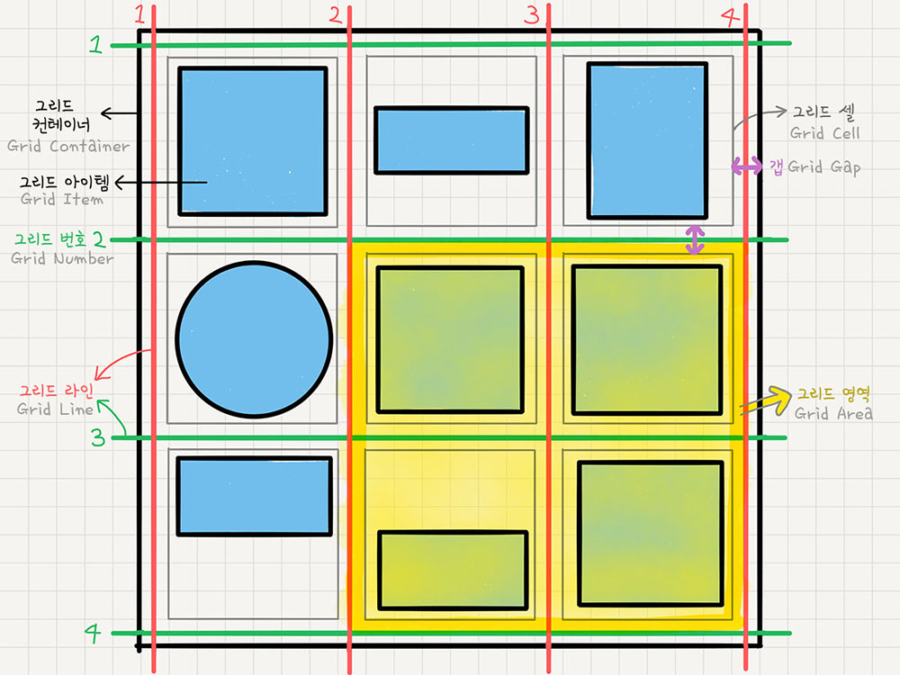

# Review CSS

## 기본 개념

### 용어

``` css
a {
  color: red;
}
```

- a: selector
- {} 안에 내용: Declaration
- color: property
- red: value

### Specificity

브라우저의 알고리즘을 사용해 CSS declaration을 결정하는 것으로 CSS selector의 weight를 계산해 결정하게 된다. Weight는 ID-CLASS-TYPE과 같이 3열로 측정하게 된다.

#### Select weight

- ID
  - ID selectors
- CLASS
  - class selectors, attribute selectors, pseudo-classes(:hover)
- TYPE
  - type selectors, pseudo-elements(::before)
- No value
  - *, :where()는 weight에 영향을 주지 않는다.
  - :not(), :is(), :has()도 영향을 주지 않는다.

``` css
:root #myApp input:required {/* 1-2-1 */
  ...
}   
```

\#myApp 으로 ID +1, :root, :required로 CLASS +1 * 2, input으로 TYPE +1 해서 1-2-1 weight를 최종적으로 가지게 된다.

#### Comparison

``` css
#myElement {
  color: green; /* 1-0-0  - WINS!! */
}
.bodyClass .sectionClass .parentClass [id="myElement"] {
  color: yellow; /* 0-4-0 */
}
```

ID가 더 높은 declaration 만약에 같으면 CLASS 가 더 높은 declaration 이렇게 내려가면서 비교하게 된다. 만약에 3열이 모두 같으면 마지막에 선언된 것이 이기게 된다.

다만 inline으로 style을 입히면 inline에 최우선이게 된다. 다만 value 옆에 !important를 적게되면 inline도 override 할 수 있다. 다만 너무 남용하지 말자.

#### Specificity 고통에서 벗어나는 팁

최대한 낮은 weight를 가진 selecter 를 사용하는 것이 좋다. 예를 들어 큰 weight를 가진 ID Selector 사용하는 대신 :where selector를 사용하면 0-0-1 weight를 가질 수 있다.

아니면 극단적으로 selector를 중복해서 씀으로써 weight를 가중해 기존 declaration을 override 할 수 있다.

> e.g. #id#id#id#id h1{}

또는 cascade layer를 이용하는 방법이 있다는데 이건 다음에 더 알아보고 모임에서 공유하겠습니다!

> ref. [Specificity - MDN](https://developer.mozilla.org/en-US/docs/Web/CSS/Specificity)

## 레이아웃

옛날에는 table로 억지로 레이아웃을 짜는 경우가 있었는데 Review HTML 글에서 썼다시피 문제들이 발생하고 Semantic 하지도 않다. 그 이후 float, inline-block, position 등으로 레이아웃을 짰지만 계속 element들이 쌓이다 보면 간혹 이게 왜 되는지도 이해가 안 되고 왜 안 된다고 하는지 이해가 안 되는 상황이 발생한다. 그래서 요즘은 Flex와 Grid를 주로 사용한다.

### Flexible Box

Flexbox, Flex 등으로 불리는 Flexible Box는 1차원 레이아웃을 설계하기 위해 나온 element이다. 덕분에 item을 간의 공간 분배 그리고 강력한 정렬 기능을 지원한다.

> Grid는 2차원 모델인 것과 대조된다.

#### Axis

Flexbox에는 2가지의 축이 있는데 item 틀이 향하고 있는 main axis와 main axis의 수직인 cross axis가 있다. main axis는 `flex-direction` property (default value: row)로 조정이 가능하다.

#### Wrap

그렇게 Container에 `display: flex` 스타일을 주고 item을 배치하다 보면 container 밖으로 삐져나가는 것을 볼 수 있을 것이다. 이는 `flex-wrap` property의 default value가 nowrap 이기 때문에 줄 바꿈이 일어나지 않아서 그런 것이다. 따라서 줄 바꿈을 원한다면 wrap으로 value를 설정하자.

> flex-flow를 사용한다면 direction과 wrap을 한 번에 설정할 수 있다.
> e.g. flex-flow: row wrap;

#### Align

이 정렬 부분이 개인적으로 Flex를 사용하게끔 만드는 부분이라고 생각한다. CSS로 가운데 정렬하는 방법을 구글에 치면 정말 온갖 방법이 다 나오는데 Flexbox를 사용하면 손쉽게 가운데 정렬을 할 수 있다. 아까 말한 두 축을 사용해서 정렬하게 되는데 main은 justify-content, cross는 align-items property를 사용해서 정렬한다.

- justify-content
  - flex-start(default)
    - direction 기준 왼쪽 혹은 위
  - flex-end
    - start의 반대
  - center ⭐️
  - space-between
    - item을의 사이에 균일한 간격
  - space-around
    - item을의 둘레에 균일한 간격
  - space-evenly
    - 사이, 양 끝 균일한 간격 (2020년 기준 모든 브라우저 지원)
- align-items
  - stretch (기본값)
  - flex-start
  - flex-end
  - center
  - baseline
    - item의 text baseline 기준으로 정렬

``` css
div .container{
  display: flex;
}

div .item{
  justify-content: center;
  align-item: center;
}
```

보통 위와 같이 가운데 정렬할 때 많이 사용한다.

#### 기타 속성들

- flex-basis
  - item의 기본 크기(최소 크기)
  - default는 auto
- flex-grow
  - flex-basis보다 더 커져서 여백을 채울 수 있게 만드는 property로 default 0이고 0보다 큰 값을 주면 여백을 채우게 된다.
  - 만약에 a는 grow 값이 1, b는 2, c는 1이라면 1:2:1 크기를 가지게 된다.
- flex-shrink
  - grow 반대로 basis의 값보다 작아질 수 있는지를 결정하는데 기본으로 1이 설정되어 만약에 0을 세팅하면 basis보다 작아지지 않기 때문에 고정 폭을 줄 수 있다.
- flex
  - 위 3가지를 축약해서 쓸 수 있다.
  - e.g. `flex: {grow} {shrink} {basis}`
- align-self: align-items의 item 버전으로 각각의 개별 성정을 우선시한다.
- order
  - 아이템들의 순서를 바꿔주는데 screen reader에서는 적용이 안 되니 웬만하면 안 쓰는 게 맞지 않나 싶다.
- z-index
  - position에서의 z-index와 마찬가지

### Grid

Flex와 달리 2차원 레이아웃 시스템이다. Flex와 똑같이 container와 item으로 이루어지게 된다.

#### Grid 용어



> ref. [1분코딩](https://studiomeal.com/archives/533)

워낙 잘 정리된 사진이라서 추가 용어 설명은 생략.

#### Container property

- grid-template-columns, rows
  - 각 열 및 행의 너비 및 높이를 설정할 수 있는 속성으로 각각 설정하면 된다.
  - 반복되는 열들을 설정하고 싶으면 repeat(n, value) 함수를 사용하면 된다.
  - 또는 최소 및 최대를 지정할 수 있는 minmax(min, max) 함수를 사용할 수도 있다.
  - 만약에 몇 개의 열을 가질지 알 수 없다면 auto-fill 또는 auto-fit을 사용하는데 더 이상 열을 더 생성할 수 없으면 열들의 너비를 넓혀 남는 공간을 채운다.
- gap
  - row-gap, column-gap, gap(row col 순서)
  - 셀 간격
- grid-auto-columns, rows
  - 위 template에서 정의되지 않은 셀들에 너비 및 높이를 지정할 수 있는 property
- grid-template-areas
  - 영역 이름 정의
  - 각 행마다 문자열을 만들고 열은 공백으로 구분
- grid-autoflow
  - 아이템이 배치되는 흐름 결정
  - default는 row, dense(순서 상관없이 빈칸 채우기), column, column dense이 있다.
- align-items
  - 세로(column) 방향으로 정렬 (각 셀 기준)
  - stretch(default), start, center, end
- justify-items
  - 가로(row) 방향으로 정렬 (각 셀 기준)
  - 옵션은 동일
- place-items 위 두 정렬 속성을 단축해서 쓸 수 있는 속성
  - align, justify 순서
- justify-content, align-content
  - 아이템들을 통째로 container 기준으로 정렬
  - 속성은 flexbox와 동일
- place-content place-items와 동일한 기능 다만 content로 적용

#### Item property

- 각 셀의 영역 지정
  - grid-column, grid-column-(start, end) / row도 똑같이 있음
  - 위에서 용어 설명했을 때 있던 Grid number로 범위를 지정할 수 있다.
  - e.g. grid-row: 1 / 2 -> 1에서 시작해서 2에서 끝
  - end를 생략하면 그냥 한 칸
  - 또는 span을 사용해서 2 / span 3 하면 라인 2에서 3칸이라고 지정할 수도 있다.
  - auto / span 3 하면 몇 칸을 차지할지만 정의 가능
- grid-area
  - container에서 정의한 영역이름 item에 지정
- align-self, justify-self
  - 각 item에 지정해서 정렬
- place-self 이 또한 단축 속성
- order, z-index flexbox와 동일
