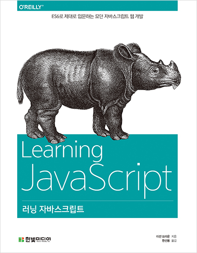
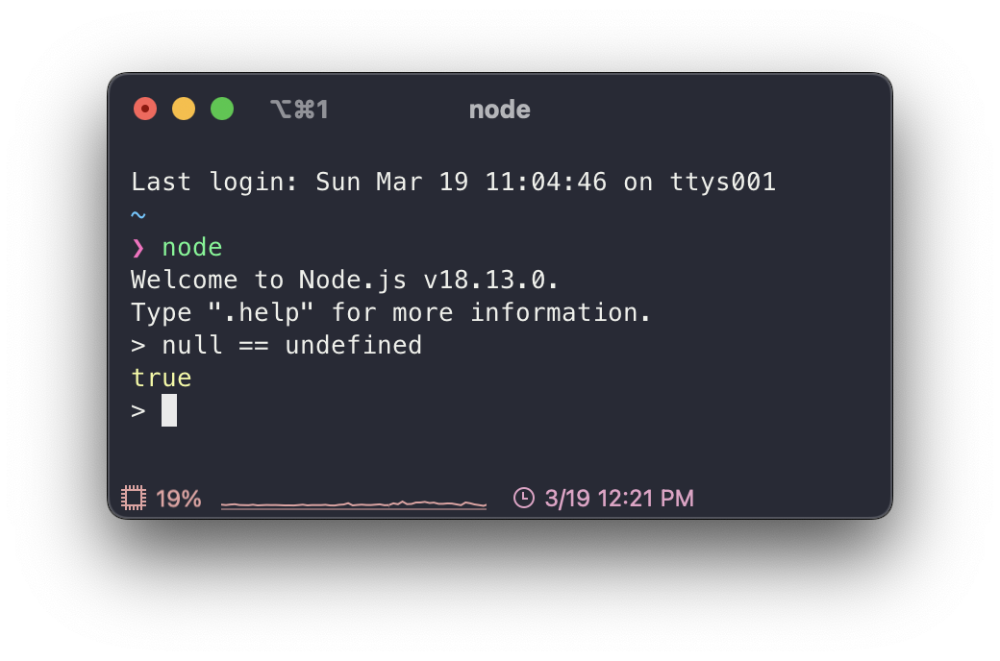
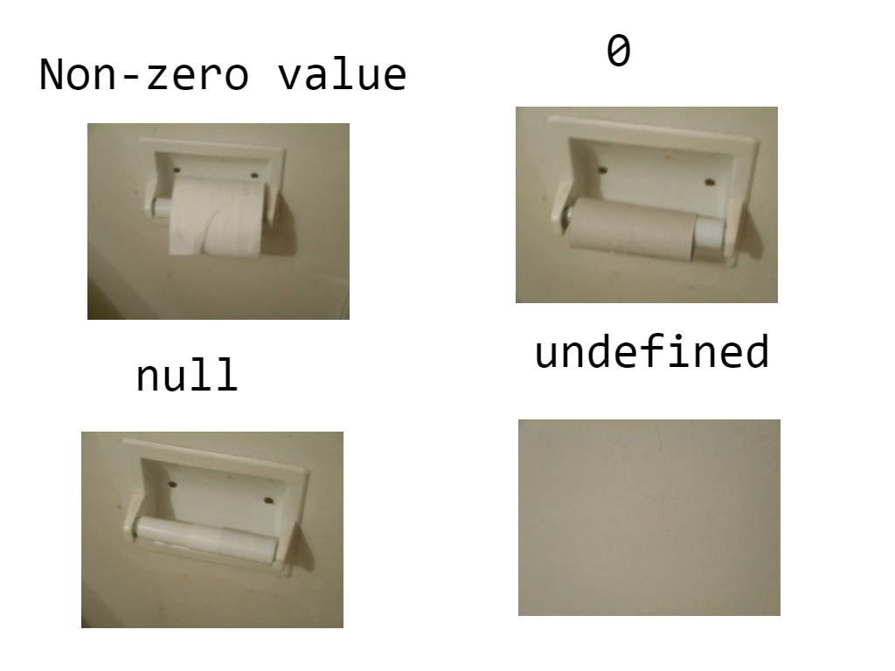
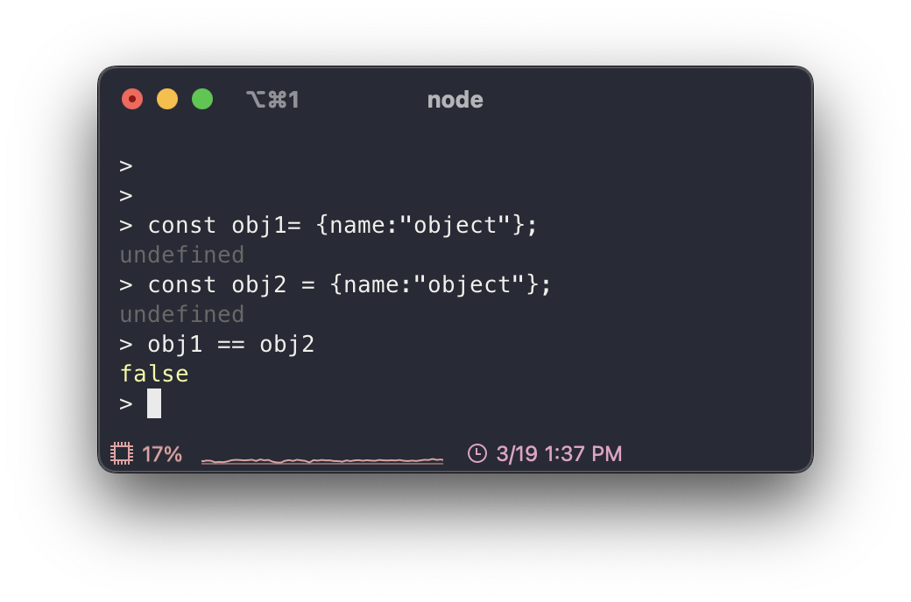

# Review JavaScript



예전에 읽었던 이선 브라운의 러닝 자바스크립트라는 책으로 다시 JavaScript를 복습했다. MDN 문서를 참조해서 만든 책이다 보니깐 신뢰할 수 있다고 생각해서 다시 읽게 됐다. 지금 당장은 map, iterator, async 등의 파트는 잠시 미뤄두고 기본적인 부분을 위주로 복습해나갔다. 해당 부분들은 다음에 추가로 작성해나가려고 한다.

## JavaScript?

객체 기반의 스크립트 프로그래밍 언어로 브렌던 아이크(Brendan Eich)가 모카라는 이름으로 만든 언어이다. 자바랑은 아무 연관이 없는 언어이지만 닷컴버블 당시 자바는 떠오르는 인기 있는 언어였다 보니 마케팅 목적으로 자바를 붙여 불렀다.

참고로 브렌던 아이크는 Mathematics와 Computer science 학사를 취득했으며 박사 과정까지 밟았다. 그 후에 10년 정도 산업(시스템 분야)에서 일하다가 Netscape에 1995년 4월 입사했고 Scheme의 함수성, Self의 객체지향, Java의 구문법과 같이 각 장점을 뽑아 10일 만에 첫 번째 버전을 만들고 그해에 JavaScript라는 이름을 내걸고 발표했다. 현재는 Brave Software를 설립했고 해당 회사는 흔히 알려진 Brave Browser를 만든 회사이다.

> ref. [Brenda Eich - Wikipedia](https://en.wikipedia.org/wiki/Brendan_Eich), [JavaScript - Wikipedia](https://en.wikipedia.org/wiki/JavaScript)

추후 Netscape는 JavaScript를 European Computer manufactures Association(ECMA)에 표준화를 위해 제출했고 ECMAScript 명세가 나오게 되었다. 현재 꾸준히 업데이트되어 ES10까지 나왔지만 2015년에 나온 ES6를 기준으로 ES6 또는 ES6+라고 부른다. 다만 브라우저의 버전마다 지원하는 ES 버전이 다르므로 Transpiling 하는 과정이 필요할 수 있다. 이를 잘 담당해주는 라이브러리(Babel)가 있으니 걱정은 안 해도 될 것 같다.

``` html
<script src="main.js" />
```

Javascript는 JS 파일 확장자를 가지고 link 태그를 사용해서 CSS 파일을 가져온 것처럼 JS는 script 태그를 사용해서 가져올 수 있다.

## 변수(var, let), 상수(const), 데이터 타입

### let, const

변수를 선언할 때 JS는 데이터 타입을 명시하지 않고 대신 변수 혹은 상수임을 나타내는 let, const를 사용한다. 또한 초기화하지 않으면 쓰레깃값을 가지고 있는 것이 아니라 undefined 값이 할당된다.

const는 C에서 상수를 define 한 것처럼 한번 초기화하고 바뀌면 안 되는 값을 const로 선언하여 안전하게 프로그래밍할 수 있다.

let, const 개념은 ES6에 나온 것으로 일단 scope 차이가 있다고 생각하고 넘어가면 될 것 같다.

> Scope 부분에서 다시 다룰 것이다.

### Data type

JS의 값은 Primitive와 object로 나뉜다.

- primitive
  - 숫자
  - 문자열
  - 불리언
  - null
  - undefined
  - symbol
- object
  - Array
  - Date
  - RegExp
  - Map
  - Set

#### Number

보통의 언어들은 정수, 실수로 나누고 또 그 안에서 data size 별로 또 나뉘지만, JavaScript는 그렇지 않고 일괄적으로 IEEE 764 Double precison Number을 사용한다.

#### String


위와 같이 비교 연산자로 문자열 비교가 가능하고 불변성을 가지고 있다. 문자열, 숫자, 불리언은 각각 대응하는 객체들(String, Number, Boolean)이 있는데 값을 저장하는 목적이 아니라 원시들을 다루기 위해 존재한다.

Javascript는 기본으로 Unicode를 지원한다. 또한 backtick(\`)을 사용하여 Template string을 다룰 수 있다. 이를 통해 복잡해질 수 있는 문자열 병합을 막을 수 있다.

> Template string은 ES6에서 지원하는 기능으로 \`${var}\`와 같이 문자열에 변숫값을 넣을 수 있다.

문자열 연산 같은 경우엔 좀 복잡한 부분이 있다. 문자열 + 숫자는 숫자가 문자열로 바뀌면서 둘이 병합이 돼지만 * 연산자는 문자열이 숫자로 바뀌면서 숫자 연산이 된다. 이러한 부분이 JavaScript의 자유 속 복잡함이라고 볼 수 있을 것 같다.

#### null vs undefined



분명히 위에서는 null이랑 undefined를 분리해서 나와 있는데 loosely equal을 사용하면 둘이 같다고 나온다. 다들 loosely equal(==) 연산을 사용할 때 type conversion이 수행돼서 둘이 같다고 나온다고 설명하는데 막 자세한 설명이 없어서 아쉬웠다.



어쨌든 둘 다 값이 없다는 것을 의미하지만 더 자세히 나누면 undefined는 값을 배정받지 못한 것이고 null은 값이지만 비어있는 값이라고 생각하면 된다. 위 사진을 참고하면 더 이해가 쉬울 것이다.

참고로 개발자는 null을 사용하고 undefined는 JS 엔진에서 사용하는 것이 일반적인 규칙이기 때문에 값이 없다는 의미로 사용할 거면 undefined를 사용하는 것은 지양하고 null을 사용하는 것이 좋다.

#### Coercion


분명히 String은 객체가 아니라 primitive인데 property를 사용할 수 있는 것을 볼 수 있다. 이는 Javascript의 Coercion이라는 개념 때문에 가능한 일이다.

Coercion는 implicit 하게 값을 변환하는 것으로 이 때문에 JS가 weakly typed하다라고 불리는 것이다. 위 같은 경우도 Primitive String을 String object로 감싸고 이를 통해 String object의 length property를 사용할 수 있었다. 정말 자유로운 언어이다.

#### Object

``` js
const obj = {
  name: "object",
  age: 11
}

obj.hello = "hello"

console.log(obj.name) // object
console.log(obj.age) // 11
console.log(obj.hello) // hello
```

Primitive type은 하나의 값만 나타낼 수 있고 불변이지만 객체는 여러 개의 값을 나타낼 수 있고 값이 바뀔 수 있다.

위와 같이 중괄호 안에 property와 value를 넣어 선언할 수 있고 다음에 `object.property = value`를 통해 새로운 property 또는 기존 property에 값을 추가 및 변경할 수 있다.

> C에서는 중괄호는 배열을 의미하지만, JS에서는 객체이고 배열은 대괄호로 만들 수 있다.



객체를 컨테이너라고 생각하면 이해하기 편할 것이다. 컨테이너 안에 다른 물건들이 들어가거나 나와도 컨테이너 자체가 바뀐 것이 아닌 것처럼 JS의 객체 또한 객체의 property가 달라진다 해도 객체 자체가 바뀌는 것도 아니고 안에 property와 value가 서로 같더라도 같은 컨테이너 및 객체가 아니다.

#### Array

JS에서 Array는 아래 기본 성질을 가지고 있다.

- Size 변경이 가능하고 다른 data types를 혼용해서 사용할 수 있다.
  - typed array도 따로 있긴 하다
- Associative array가 아니기 때문에 임의적인 문자열을 index로 사용할 수 있다.
- zero-indexed이므로 0부터 시작한다.
- Array를 copy 할 때 shallow copy로 한다.

즉 JS의 Array는 동적배열, Linked List 등의 장점을 혼합한 강력한 Array이다.

#### Converse String to Number

문자열을 숫자로 명시적으로 바꿀 때 `Number("0")`라고 해도 되지만 만약에 문자열에 숫자를 제외한 문자들이 포함되면 NaN을 반환한다. 따라서 "100km" 이러한 문자열을 숫자로 변환하고 싶으면 `parseInt()` 또는 `parseFloat()` 내장함수를 사용하자.
