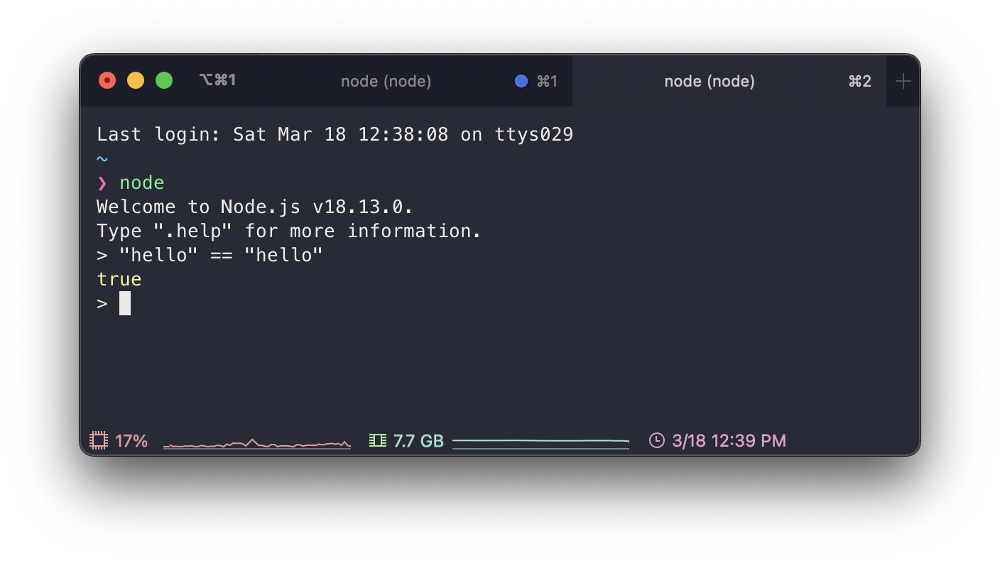

# Review JavaScript


예전에 읽었던 이선 브라운의 러닝 자바스크립트라는 책으로 다시 JavaScript를 복습했다. MDN 문서를 참조해서 만든 책이다 보니깐 신뢰할 수 있다고 생각해서 다시 읽게 됐다. 지금 당장은 map, iterator, async 등의 파트는 잠시 미뤄두고 기본적인 부분을 위주로 복습해나갔다. 해당 부분들은 다음에 추가로 작성해나가려고 한다.

## JavaScript?

객체 기반의 스크립트 프로그래밍 언어로 브렌던 아이크(Brendan Eich)가 모카라는 이름으로 만든 언어이다. 자바랑은 아무 연관이 없는 언어이지만 닷컴버블 당시 자바는 떠오르는 인기 있는 언어였다 보니 마케팅 목적으로 자바를 붙여 불이었다.

참고로 브렌던 아이크는 Mathematics와 Computer science 학사를 취득했으며 박사 과정까지 밟았다. 그 후에 10년 정도 산업(시스템 분야)에서 일하다가 Netscape에 1995년 4월 입사했고 Scheme의 함수성, Self의 객체지향, Java의 구문법과 같이 각 장점을 뽑아 10일 만에 첫 번째 버전을 만들고 그해에 JavaScript라는 이름을 내걸고 발표했다. 현재는 Brave Software를 설립했고 해당 회사는 흔히 알려진 Brave Browser를 만든 회사이다.

> ref. [Brenda Eich - Wikipedia](https://en.wikipedia.org/wiki/Brendan_Eich), [JavaScript - Wikipedia](https://en.wikipedia.org/wiki/JavaScript)

추후 Netscape는 JavaScript를 European Computer manufactures Association(ECMA)에 표준화를 위해 제출했고 ECMAScript 명세가 나오게 되었다. 현재 꾸준히 업데이트되어 ES10까지 나왔지만 2015년에 나온 ES6를 기준으로 ES6 또는 ES6+라고 부른다. 다만 브라우저의 버전마다 지원하는 ES 버전이 다르므로 Transpiling 하는 과정이 필요할 수 있다. 이를 잘 담당해주는 라이브러리(Babel)가 있으니 걱정은 안 해도 될 것 같다.

``` html
<script src="main.js" />
```

Javascript는 JS 파일 확장자를 가지고 link 태그를 사용해서 CSS 파일을 가져온 것처럼 JS는 script 태그를 사용해서 가져올 수 있다.

## 변수(var, let), 상수(const), 데이터 타입

### let, const

변수를 선언할 때 JS는 데이터 타입을 명시하지 않고 대신 변수 혹은 상수임을 나타내는 let, const를 사용한다. 또한 초기화하지 않으면 쓰레깃값을 가지고 있는 것이 아니라 undefined 값이 할당된다.

const는 C에서 상수를 define 한 것처럼 한번 초기화하고 바뀌면 안 되는 값을 const로 선언하여 안전하게 프로그래밍할 수 있다.

let, const 개념은 ES6에 나온 것으로 일단 scope 차이가 있다고 생각하고 넘어가면 될 것 같다.

> Scope 부분에서 다시 다룰 것이다.

### Data type

JS의 값은 Primitive와 object로 나뉜다.

- primitive
  - 숫자
  - 문자열
  - 불리언
  - null
  - undefined
  - symbol
- object
  - Array
  - Date
  - RegExp
  - Map
  - Set

위와 같이 나누어지는데 신기하게도 문자열이 primitive에 들어가 있다.



따라서 위와 같이 비교 연산자로 문자열 비교가 가능하고 불변성을 가지고 있다. 문자열, 숫자, 불리언은 각각 대응하는 객체들(String, Number, Boolean)이 있는데 값을 저장하는 목적이 아니라 원시들을 다루기 위해 존재한다.

#### Number

보통의 언어들은 정수, 실수로 나누고 또 그 안에서 data size 별로 또 나뉘지만, JavaScript는 그렇지 않고 일괄적으로 IEEE 764 Double precison Number을 사용한다.

#### String

Javascript는 기본으로 Unicode를 지원한다. 또한 backtick(\`)을 사용하여 Template string을 다룰 수 있다. 이를 통해 복잡해질 수 있는 문자열 병합을 막을 수 있다.

> Template string은 ES6에서 지원하는 기능으로 \`${var}\`와 같이 문자열에 변숫값을 넣을 수 있다.

문자열 연산 같은 경우엔 좀 복잡한 부분이 있다. 문자열 + 숫자는 숫자가 문자열로 바뀌면서 둘이 병합이 돼지만 * 연산자는 문자열이 숫자로 바뀌면서 숫자 연산이 된다. 이러한 부분이 자바스크립트의 자유 속 복잡함이라고 볼 수 있을 것 같다.


